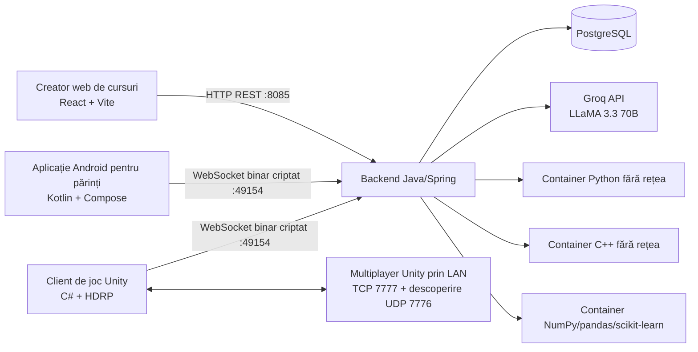
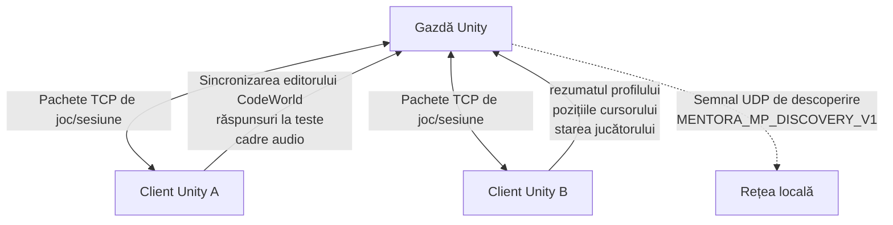
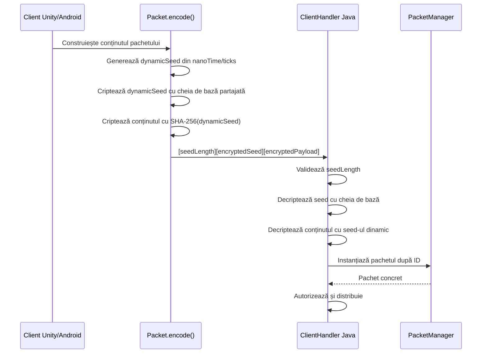
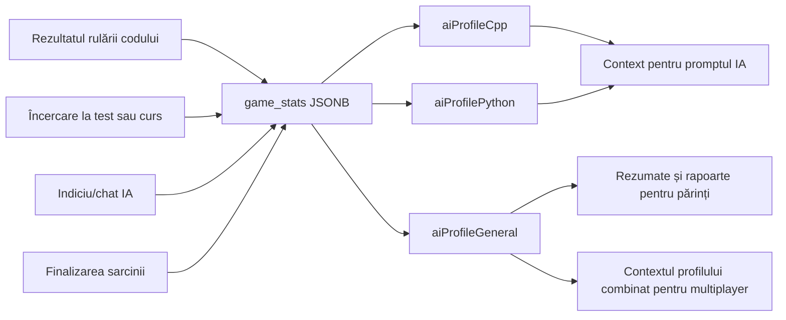
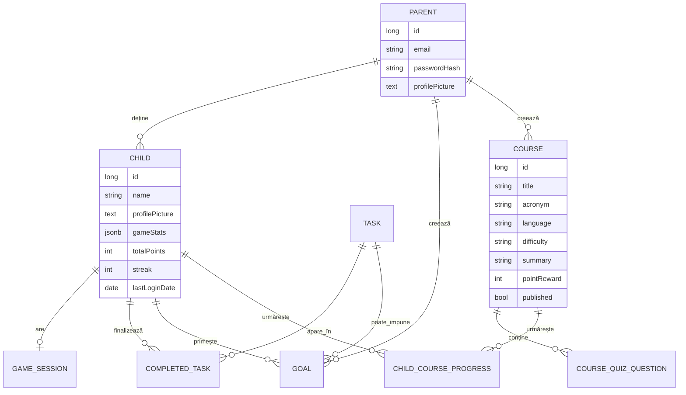

# Mentora

Mentora este un ecosistem educațional bazat pe IA pentru învățarea programării și a învățării automate prin intermediul unui joc Unity, al aplicațiilor Android/iOS pentru părinți, al unui creator web de cursuri și al unui backend Java/Spring. Proiectul îi învață pe copii Python, C++ și concepte AI/ML punându-i să scrie și să ruleze cod real, să lucreze cu seturi de date, să primească îndrumare oferită de IA și să își construiască un profil de învățare persistent.

Acest README se bazează pe codul sursă actual, nu doar pe notele mai vechi ale proiectului. Implementarea include în prezent pachete backend până la `80`, un nivel multiplayer Unity prin LAN separat, editare colaborativă CodeWorld, o insulă AI/ML cu evaluare deterministă pe server, provocări generate de IA, provocări trimise de părinți, rapoarte săptămânale, monitorizarea în timp real a sesiunilor și un companion cu interacțiune vocală.

## Prezentare vizuală

Toate imaginile din [`images/`](images/) sunt incluse mai jos.

### Jocul Unity

| Harta lumii | Harta actualizată | Scenă din joc |
| --- | --- | --- |
|  |  |  |

| Joc pe mobil | Insula codului | Insula Python |
| --- | --- | --- |
|  |  |  |

| Secțiunea Python | Programare în Python | Secțiunea C++ |
| --- | --- | --- |
|  |  |  |

| Interacțiune cu IA în C++ | Provocare Python generată de IA | Mentor IA pentru Python | Test |
| --- | --- | --- | --- |
|  |  |  |  |

| Întrebare de test | Meniul de pauză | Ghidul lui Rudolf |
| --- | --- | --- |
|  |  |  |

| Continuarea ghidului lui Rudolf | Răspunsul lui Rudolf | Rudolf pe PC |
| --- | --- | --- |
|  |  |  |

#### Experiența în realitate virtuală

| Jocul Mentora în VR | Conversație cu Rudolf în VR |
| --- | --- |
|  |  |

Mentora poate fi explorată în realitate virtuală, folosind controlere VR pentru deplasare și interacțiune. Companionul educațional Rudolf rămâne disponibil și în această experiență, unde utilizatorul poate comunica direct cu el și poate primi îndrumare în lumea 3D.

| Comunitate | Proiectil | Obiect de tip cutie |
| --- | --- | --- |
|  |  |  |

### Aplicația pentru părinți

| Panoul copiilor | Detalii din panoul copiilor | Obiective |
| --- | --- | --- |
|  |  |  |

| Profilul părintelui | Setări | Tema setărilor |
| --- | --- | --- |
|  |  |  |

| Analiza competențelor | Radarul competențelor | Istoricul sarcinilor |
| --- | --- | --- |
|  |  |  |

### Creatorul web de cursuri

| Panoul creatorului | Biblioteca de cursuri și editorul | Interfața creatorului în franceză |
| --- | --- | --- |
|  |  |  |

## Cuprins

- [Arhitectura sistemului](#arhitectura-sistemului)
- [Structura repository-ului](#structura-repository-ului)
- [Stiva tehnologică](#stiva-tehnologică)
- [Backend](#backend)
- [Criptarea pachetelor binare](#criptarea-pachetelor-binare)
- [Referință pentru pachete](#referință-pentru-pachete)
- [Autentificare](#autentificare)
- [Profil de învățare pentru fiecare elev](#profil-de-învățare-pentru-fiecare-elev)
- [Sistemul de IA](#sistemul-de-ia)
- [Executarea securizată a codului](#executarea-securizată-a-codului)
- [Jocul Unity](#jocul-unity-1)
- [Aplicația Android pentru părinți](#aplicația-android-pentru-părinți)
- [Creatorul web de cursuri](#creatorul-web-de-cursuri-1)
- [Cursuri, sarcini, obiective și rapoarte](#cursuri-sarcini-obiective-și-rapoarte)
- [Modelul bazei de date](#modelul-bazei-de-date)
- [Note despre securitate](#note-despre-securitate)
- [Rularea proiectului](#rularea-proiectului)
- [Starea actuală a testării](#starea-actuală-a-testării)

## Arhitectura sistemului

Mentora folosește o arhitectură cu mai mulți clienți și un singur backend. Backendul Java este sursa de adevăr pentru identitate, progres, datele profilului IA, conținutul cursurilor, finalizarea sarcinilor, obiective și executarea codului. Unity și Android comunică cu acesta printr-un protocol WebSocket binar criptat. Creatorul web folosește REST.



Clientul Unity conține și un al doilea nivel de rețea, separat de backendul Java. `MultiplayerSessionManager.cs` gestionează descoperirea în LAN, găzduirea sesiunilor și conectarea la acestea, avatarurile jucătorilor la distanță, pachetele de test, chatul vocal, sincronizarea CodeWorld și partajarea profilurilor în modul multiplayer.



## Structura repository-ului

| Cale | Scop |
| --- | --- |
| `java-server/Java-Server/` | Backend Spring Boot, server WebSocket, API REST, integrare IA, executarea codului, persistență |
| `unity/` | Client de joc Unity 2022.3.62f3 HDRP |
| `kotlin-app/` | Panou Android pentru părinți, construit cu Kotlin și Jetpack Compose |
| `web-creator/` | Platformă React/Vite pentru crearea cursurilor |
| `images/` | Capturi de ecran ale proiectului, folosite în acest README și în materialele de prezentare |
| `mentora-presentation-slidev/` | Resurse pentru prezentarea Slidev |

## Stiva tehnologică

| Strat | Tehnologii |
| --- | --- |
| Backend | Java 21, Spring Boot 3.2.4, Spring Data JPA, Hibernate, PostgreSQL |
| Protocol backend în timp real | Java-WebSocket, pachete binare criptate personalizate |
| IA | Groq API, `llama-3.3-70b-versatile`, memorie cache pentru răspunsuri, rotația cheilor API |
| Executarea codului | Containere Docker efemere pentru Python, C++, CodeWorld și NumPy/pandas/scikit-learn |
| Joc | Unity 2022.3.62f3, C#, HDRP |
| Android | Kotlin, Jetpack Compose, CameraX, ZXing pentru scanarea codurilor QR, Coil |
| Web | React 19, Vite 7, Tailwind CSS v4, Framer Motion, lucide-react |

## Backend

Backendul este autoritatea centrală a platformei. Acesta gestionează datele conturilor, profilurile copiilor, istoricul învățării, cursurile publicate, sarcinile, obiectivele, starea sesiunilor în timp real, provocările trimise de părinți, rapoartele săptămânale, apelurile către IA și executarea codului.

Fișiere importante:

| Fișier | Rol |
| --- | --- |
| `client/ClientHandler.java` | Dispecerul principal pentru pachetele WebSocket și punctul de control al autorizării |
| `packet/Packet.java` | Clasa de bază a pachetelor, criptare/decriptare, serializarea șirurilor de caractere |
| `packet/PacketManager.java` | Fabrica de pachete pentru ID-urile pachetelor backend |
| `database/services/LearningProfileService.java` | Actualizări ale profilului IA pentru fiecare copil, rezumate, rapoarte săptămânale |
| `machinelearning/MachineLearningService.java` | Catalogul celor nouă probleme AI/ML, evaluarea ascunsă, progresul și recompensele |
| `machinelearning/MachineLearningExecutor.java` | Rularea soluțiilor AI/ML în containerul științific Python |
| `database/services/CourseService.java` | Operații CRUD pentru cursuri, publicare, finalizare, logica recompenselor |
| `database/services/TaskService.java` | Popularea inițială a sarcinilor globale și finalizarea sarcinilor |
| `utility/GroqAI.java` | Componentă de integrare pentru API-ul de chat Groq, memorie cache pentru răspunsuri, rotația cheilor |
| `python/PythonExecutor.java` | Executarea Python într-un mediu izolat |
| `cpp/CppExecutor.java` | Compilarea și executarea C++ într-un mediu izolat |
| `utility/ContainerExecution.java` | Politica comună de izolare Docker pentru tot codul trimis de elevi |
| `web/WebAuthController.java` | Endpointuri web pentru autentificare |
| `web/WebCourseController.java` | API REST web pentru cursuri |

`Server.java` păstrează starea activă din timpul rulării:

- `activeConnections` pentru clienții conectați.
- `pendingQRLogins` pentru asocierea autentificărilor prin QR.
- `latestLiveSessionStates` pentru monitorizarea în timp real de către părinți.
- `liveSessionSpectators` pentru clienții abonați de tip părinte.
- `activeParentChallenges` pentru provocările trimise de părinți.

## Criptarea pachetelor binare

Unity și Android nu trimit JSON în clar către WebSocket-ul backendului. Acestea folosesc un format binar personalizat pentru pachete, implementat în Java, C# și Kotlin.



Structura cadrului:

```text
[lungimea seed-ului pe 4 octeți][seed criptat][conținut criptat]
```

Detalii despre criptare confirmate în cod:

- Algoritm: `AES/CBC/PKCS5Padding` în Java, `Aes` cu `CBC` și `PKCS7` în C#.
- Derivarea cheii: hashul SHA-256 al șirului furnizat pentru parolă/seed.
- IV: un IV aleatoriu de 16 octeți, adăugat înaintea textului cifrat.
- Seed dinamic: generat pentru fiecare pachet, criptat cu `Data.baseKey`, apoi folosit drept cheie pentru conținut.
- Validare defensivă: lungimea seed-ului trebuie să fie pozitivă și să nu depășească `1024`.

Serializarea șirurilor în interiorul pachetelor folosește:

```text
[lungime int][octeți UTF-8]
```

## Referință pentru pachete

Există două sisteme de pachete:

- Pachetele WebSocket ale backendului, gestionate de `java-server/Java-Server/.../PacketManager.java`.
- Pachetele multiplayer locale din Unity, gestionate de `unity/Assets/Scripts/Runtime/Network/PacketManager.cs`.

### Pachete WebSocket ale backendului

| ID | Pachet | Scop |
| --- | --- | --- |
| `1` | `HandShakePacket` | Clientul se identifică după conexiunea WebSocket |
| `2` | `AuthPacket` | Autentificarea părintelui prin WebSocket |
| `3` | `RegisterParentPacket` | Înregistrarea părintelui prin WebSocket |
| `4` | `AddChildPacket` | Adăugarea unui copil părintelui autentificat |
| `5` | `AddGoalPacket` | Crearea unui obiectiv pentru copil |
| `8` | `CompleteTaskPacket` | Marcarea sarcinii drept finalizată și acordarea punctelor aferente |
| `9` | `ActionResponsePacket` | Răspuns generic de succes/eroare |
| `10` | `AuthResponsePacket` | Răspunsul la autentificarea părintelui |
| `11/12` | `FetchTasksPacket` / răspuns | Catalogul global de sarcini |
| `13/14` | `FetchGoalsPacket` / răspuns | Obiectivele unui copil |
| `15/16` | `FetchChildrenPacket` / răspuns | Lista copiilor părintelui și indicatorii stării online |
| `17/18` | `FetchCompletedTasksPacket` / răspuns | Istoricul sarcinilor finalizate |
| `19/20` | `GenerateQRLoginPacket` / răspuns | Crearea tokenului pentru autentificare prin QR |
| `21` | `ClaimQRLoginPacket` | Aplicația părintelui revendică tokenul QR pentru copil |
| `22` | `ChildAuthResponsePacket` | Răspunsul la autentificarea copilului în joc |
| `23/24` | `FetchChildStatsPacket` / răspuns | Statisticile copilului și profilul de joc în format JSON |
| `25` | `VerifySessionPacket` | Reluarea sesiunii de joc |
| `26` | `UpdatePfpPacket` | Actualizarea imaginii de profil a părintelui sau a copilului |
| `27` | `RemoveChildPacket` | Ștergerea profilului copilului |
| `28/29` | `ExecuteCPPCodePacket` / răspuns | Compilarea și rularea codului C++ |
| `30/31` | `AskAiPacket` / `AiResponsePacket` | Conversația cu mentorul IA și evaluarea |
| `32` | `FetchChildStatsByParentPacket` | Părintele preia statisticile copilului fără a-i actualiza seria |
| `33` | `RecordLearningEventPacket` | Scrierea unui eveniment de învățare în profilul copilului |
| `34/35` | `ExecutePythonCodePacket` / răspuns | Rularea codului Python |
| `36/37` | `FetchPublishedCoursesPacket` / răspuns | Catalogul cursurilor publicate |
| `38/39` | `FetchCourseDetailPacket` / răspuns | Detaliile cursului publicat |
| `40` | `SubmitCourseCompletionPacket` | Salvarea încercării la curs și a eventualei recompense |
| `41/42` | `FetchAllChildrenPacket` / răspuns | Listarea copiilor pentru dezvoltare/administrare |
| `43` | `DevLoginAsChildPacket` | Scurtătură pentru dezvoltatori pentru autentificarea drept copil |
| `44` | `DevCreateChildProfilePacket` | Scurtătură pentru dezvoltatori pentru crearea unui profil de copil |
| `45/46` | `GenerateAiTaskPacket` / răspuns | Provocare generată de IA |
| `47/48` | `CompanionSpeakPacket` / răspuns | Răspunsul text al companionului |
| `58/59` | `CompanionVoiceTextPacket` / `CompanionVoiceAudioPacket` | Intrare vocală/text pentru companion |
| `64/65` | `SubscribeLiveSessionPacket` / `LiveSessionUpdatePacket` | Monitorizarea în direct de către părinte a sesiunii |
| `66/67/68` | Pachete pentru provocări trimise de părinte | Părintele trimite provocarea și primește confirmarea finalizării |
| `69/70` | Pachete pentru raportul săptămânal | Raportul IA săptămânal pentru părinte |
| `71/72` | Pachete cu rezumatul profilului de programare | Rezumatul profilului copilului pentru contextul jocului/modului multiplayer |
| `74/75` | `CodeWorldPythonRunPacket` / răspuns | Rularea corelată a codului Python care controlează CodeWorld |
| `76` | `SetClientLanguagePacket` | Limba preferată pentru răspunsurile serverului |
| `77/78` | `FetchMachineLearningProblemsPacket` / răspuns | Catalogul AI/ML și progresul copilului |
| `79/80` | `SubmitMachineLearningSolutionPacket` / rezultat | Rularea, evaluarea ascunsă și recompensa unei soluții AI/ML |

`ClientHandler.java` aplică o listă de permisiuni pentru clienții neautentificați. Pachetele din afara setului permis returnează un `ActionResponsePacket` de neautorizare, cu excepția cazului în care clientul are o sesiune validă de părinte sau copil.

### Pachete multiplayer locale Unity

Aceste pachete sunt definite în clientul Unity și aparțin modului multiplayer prin LAN, nu backendului Java:

| ID | Pachet | Scop |
| --- | --- | --- |
| `49/50` | `MultiplayerJoinPacket` / `MultiplayerWelcomePacket` | Alăturarea la sesiunea gazdă |
| `51/52` | `MultiplayerPlayerStatePacket` / `MultiplayerPlayerLeftPacket` | Starea jucătorului la distanță |
| `53/54/55` | `QuizStartPacket` / `QuizAnswerPacket` / `QuizResultPacket` | Fluxul testului multiplayer |
| `56/57` | `MultiplayerVoicePacket` / `MultiplayerUdpHelloPacket` | Voce și descoperire UDP |
| `60/61` | `CodeWorldCommandPacket` / `CodeWorldStatePacket` | Sincronizarea comenzilor și stării CodeWorld |
| `62/63` | `CodeWorldEditorSyncPacket` / `CodeWorldCursorPacket` | Textul partajat al editorului și cursoarele cu nume |
| `73` | `MultiplayerProfileSummaryPacket` | Partajarea profilului de programare al fiecărui jucător |

## Autentificare

Mentora are fluxuri separate pentru părinți și copii.

### Autentificarea părinților

Părinții se pot autentifica prin pachete WebSocket Android sau prin API-ul REST web. API-ul web expune:

| Metodă | Endpoint | Scop |
| --- | --- | --- |
| `POST` | `/api/web/auth/lookup` | Verifică dacă există o adresă de e-mail |
| `POST` | `/api/web/auth/register` | Creează părintele și returnează tokenul |
| `POST` | `/api/web/auth/login` | Autentifică și returnează tokenul |

Datele de autentificare sunt transformate în hash cu `SHA-256` în `HashUtility`. Sesiunile web sunt tokenuri UUID stocate în memorie de `WebSessionService`, cu un TTL de 7 zile.

### Autentificarea copiilor prin QR

Copiii nu introduc acreditări în joc. Jocul folosește asocierea prin QR:

1. Unity trimite `GenerateQRLoginPacket`.
2. Backendul returnează un token scurt prin `QRLoginResponsePacket`.
3. Părintele scanează codul QR din Android.
4. Android trimite `ClaimQRLoginPacket` împreună cu tokenul și ID-ul copilului.
5. Backendul trimite `ChildAuthResponsePacket` clientului de joc aflat în așteptare.
6. Unity stochează ID-ul copilului/tokenul de sesiune, iar ulterior reia sesiunea prin `VerifySessionPacket`.

## Profil de învățare pentru fiecare elev

Fiecare copil are o coloană JSONB `game_stats` în tabelul `children`. Profilul este flexibil în mod intenționat și este gestionat de `LearningProfileService`.



Câmpurile urmărite includ:

- `correctCount`
- `incorrectCount`
- `hintsUsed`
- `chatTurns`
- `totalInteractions`
- statistici pe subiecte
- concepte bine stăpânite și concepte dificile
- greșeli frecvente
- evenimente recente de învățare
- `summaryText`
- `summaryOneLine`
- `summaryThreeLine`
- marca temporală a actualizării rezumatului

`recordLearningEvent()` actualizează profilurile specifice limbajului și pe cele generale. `recordAiInteraction()` omite contextele care conțin `eval`, astfel încât evaluarea IA să nu mărească artificial numărul utilizărilor de indicii/chat.

`buildProfileSummary()` clasifică elevul drept `beginner`, `intermediate` sau `advanced` pe baza numărului de interacțiuni și a acurateței. `buildAiHelpProfileContext()` serializează profilul copilului ca text pentru prompturile IA. `buildMultiplayerProgrammingProfileSummary()` produce un șir compact al profilului, folosit de Unity la combinarea profilurilor multiplayer.

## Sistemul de IA

Stratul de IA are în centru Groq și `llama-3.3-70b-versatile`.

Capabilitățile din baza de cod actuală:

- Conversații cu mentorul IA prin `AskAiPacket`.
- Contexte de evaluare a codului asistate de IA.
- Flux de sarcini/provocări generate de IA prin `GenerateAiTaskPacket`.
- Replici ale companionului IA prin `CompanionSpeakPacket`.
- Intrare vocală pentru companion prin transcriere sau pachete audio PCM.
- Rezumate și rapoarte săptămânale destinate părinților.
- Generarea contextului pentru teste/profiluri multiplayer din profilurile combinate ale jucătorilor.

`GroqAI.java` include:

- Un cache LRU de răspunsuri cu 200 de intrări.
- Un TTL al cache-ului de 5 minute.
- O limită de timp de 35 de secunde pentru solicitări.
- Rotirea cheilor API atunci când acestea expiră sau întâlnesc coduri de stare pentru care solicitarea poate fi reîncercată.
- Șiruri de eroare de rezervă atunci când nu este configurată nicio cheie sau Groq nu este disponibil.

## Executarea securizată a codului

Codul elevului este executat pe server, dar nu direct în procesul backendului.

Toate căile de execuție — Python, C++, CodeWorld Python și problemele AI/ML — folosesc imagini Docker fixate și containere noi pentru fiecare rulare. Procesul Java nu mai pornește interpretorul sau compilatorul direct pe gazdă. Imaginile se construiesc prin `sh code-runners/build-images.sh`.

Politica sandboxului:

| Limită | Valoare |
| --- | --- |
| Identitate | UID/GID `65532`, fără privilegii root |
| Rețea | `--network none` |
| Sistem de fișiere | rădăcină și surse read-only; doar `/tmp` temporar |
| Privilegii | toate capabilitățile eliminate, `no-new-privileges` |
| Resurse | un CPU, memorie fixată, maximum 64 procese și 64 descriptori |
| Fișiere/ieșire | fișiere de maximum 2 MB; stdout/stderr limitate la 16 KB |
| Timp | timeout Java; containerul este eliminat forțat dacă expiră |

Seturile de date de antrenare și caracteristicile de test sunt montate în containerul AI/ML, însă etichetele ascunse rămân în procesul Java. Corectitudinea și recompensele sunt astfel stabilite exclusiv de evaluatorul serverului, nu de client sau de un răspuns LLM.

## Jocul Unity

Jocul Unity reprezintă experiența principală a elevului. Acesta include panouri de programare, insule cu teste, explorarea cursurilor comunității, provocări generate de IA, un personaj companion, mod multiplayer în rețeaua LAN și CodeWorld.

Scripturi importante:

| Script | Responsabilitate |
| --- | --- |
| `GameClient.cs` | Conectarea prin WebSocket la backend și trimiterea și primirea pachetelor criptate |
| `PauseMenuManager.cs` | Centrul interfeței, fluxul de autentificare, meniurile multiplayer și punctele de acces către CodeWorld și Quiz Island |
| `MultiplayerSessionManager.cs` | Găzduirea sesiunilor în LAN și conectarea la acestea, descoperirea sesiunilor, avatarurile la distanță, comunicarea vocală, pachetele pentru teste și sincronizarea profilurilor |
| `CodeWorldRuntime.cs` | Editorul „Your Code Controls The World” și modificarea scenei în timpul rulării |
| `MultiplayerQuizManager.cs` | Starea testului multiplayer, punctajul și cronometrarea răspunsurilor |
| `CommunityIslandMenu.cs` | Explorarea cursurilor publicate și parcurgerea testelor acestora |
| `AiChallengePad.cs` | Fluxul provocărilor personalizate generate de IA |
| `RobotCompanion.cs` | Comportamentul companionului în joc și declanșatoarele text/vocale |
| `PythonDebugPadCinematic.cs` | Provocările Python și fluxul de evaluare cu IA |
| `CodeChallengePadCinematic.cs` | Panourile de programare/depanare C++ |
| `CppQuestionPadCinematic.cs` | Panoul cu întrebări C++ cu variante multiple de răspuns |

### AI & Machine Learning Island

Insula AI/ML este salvată în scena principală și conține portaluri deschise pentru `Easy`, `Medium` și `Hard`. Catalogul este livrat de server prin pachetele `77/78`, iar soluțiile corelate prin `requestId` sunt trimise și evaluate prin `79/80`. Cele nouă probleme acoperă pregătirea datelor, regresia, clasificarea, evaluarea modelelor, rețele neuronale, NLP și bazele predicției următorului token. Progresul și recompensele sunt persistente și idempotente în `ChildMachineLearningProgress`.

Profilul rezultat este stocat sub cheia JSON `aiProfileMachineLearning`. Aplicațiile Android și iOS îl afișează separat, cu radar pentru Data Prep, Regression, Classification, Evaluation, Neural Networks și LLMs; clienții mai vechi ignoră în siguranță cheia nouă.

### CodeWorld

CodeWorld este accesibil din `PauseMenuManager -> Multiplayer -> Host Game -> Your Code Controls The World`. Jucătorul este teleportat la `CodeWorldRuntime.SpawnPosition`, iar un editor de cod care poate fi afișat sau ascuns în joc este activat.

Funcționalitățile implementate includ:

- editor de cod afișat ca suprapunere/fereastră.
- editarea comenzilor cu ajutorul tastaturii.
- crearea și manipularea obiectelor prin comenzi asemănătoare codului.
- primitive de tip cub, sferă, dreptunghi/cerc, în funcție de comenzile acceptate de `CodeWorldRuntime`.
- suport pentru bucle și interpretarea comenzilor în interpretorul CodeWorld.
- istoric local și serializarea stării.
- sincronizarea în timp real a editorului în modul multiplayer.
- cursoare denumite pentru utilizatorii la distanță.
- resincronizarea instantaneului pentru clienții care se alătură după gazdă.
- ascunderea companionului obișnuit atunci când acest lucru este potrivit pentru modul CodeWorld.

Pachetele multiplayer CodeWorld sunt pachete locale ale sesiunii Unity:

- `CodeWorldCommandPacket`
- `CodeWorldStatePacket`
- `CodeWorldEditorSyncPacket`
- `CodeWorldCursorPacket`

### Quiz Island

Quiz Island este găzduită prin meniul multiplayer. Aceasta oferă:

- opțiuni de test controlate de gazdă.
- preluarea conținutului testelor/cursurilor.
- generarea testelor pe baza profilului IA.
- colectarea răspunsurilor în modul multiplayer.
- calcularea punctajului în funcție de timpul de răspuns în `MultiplayerQuizManager`.
- încheierea întrebării după ce toți jucătorii au răspuns, urmată de o scurtă întârziere înainte de continuare.
- un context combinat al profilurilor de programare atunci când în lobby se află mai mulți jucători.

### Combinarea profilurilor multiplayer

`MultiplayerSessionManager` stochează intrări `ProgrammingProfileSnapshot` pentru jucătorii locali și cei la distanță:

- `ClientId`
- `PlayerName`
- `ChildId`
- `ChildName`
- `TotalPoints`
- `Streak`
- `CompletedTaskCount`
- `TotalTaskCount`
- `ProfileSummary`

`BuildMergedProgrammingProfileContext()` combină profilurile disponibile ale jucătorilor, astfel încât testele multiplayer generate de IA să poată ține cont de toți participanții, nu doar de gazdă.

### Voce și companion

Jocul Unity oferă suport pentru:

- răspunsuri text din partea companionului.
- pachete cu transcrierea vocii.
- pachete audio vocale PCM neprelucrate.
- chat vocal local în modul multiplayer.
- modurile vocale `AlwaysOn`, `PushToTalk`, `Muted`.
- declanșatoare contextuale pentru companion, precum reușita/eșecul unei provocări și accesarea panourilor de programare.

## Aplicația Android pentru părinți

Aplicația Android este o suită de monitorizare parentală, nu doar un client de autentificare.

Fișiere principale:

| Fișier | Responsabilitate |
| --- | --- |
| `MainActivity.kt` | Punctul de intrare al aplicației Android |
| `ui/AuthScreen.kt` | Interfața de autentificare/înregistrare pentru părinți |
| `ui/MainDashboard.kt` | Tabloul de bord Compose, copiii, obiectivele, istoricul și setările |
| `ui/SocketViewModel.kt` | Starea WebSocket, pachetele, modelele de date și notificările |
| `socket/ClientSocket.java` | Clientul WebSocket |
| `socket/packet/Packet.java` | Componenta corespondentă pentru serializarea/criptarea pachetelor |

Funcționalitățile implementate ale aplicației includ:

- autentificarea/înregistrarea părinților.
- o buclă de reconectare.
- un tablou de bord pentru copii, cu punctaj și stare online.
- un flux de scanare a codurilor QR pentru asocierea sesiunilor de joc.
- fotografii de profil pentru copii.
- suport pentru fotografia de profil a părintelui.
- istoricul sarcinilor.
- obiective.
- starea abonării la sesiunea în timp real.
- profiluri IA pentru fiecare limbaj și un profil general.
- rapoarte săptămânale.
- notificări de sistem la primirea activității copilului.
- personalizarea temei și modul întunecat.

## Creatorul web de cursuri

Creatorul web le permite părinților sau educatorilor să gestioneze conținutul cursurilor care apare în jocul Unity.

Fișiere importante:

| Fișier | Responsabilitate |
| --- | --- |
| `src/App.jsx` | Aplicația SPA principală, starea autentificării, tabloul de bord și editorul de cursuri |
| `src/lib/api.js` | Funcții auxiliare pentru API-ul REST |
| `src/main.jsx` | Punctul de intrare React |
| `src/styles.css` | Stilizarea Tailwind/CSS |

API REST:

| Metodă | Endpoint | Scop |
| --- | --- | --- |
| `POST` | `/api/web/auth/lookup` | Determină fluxul de autentificare/înregistrare |
| `POST` | `/api/web/auth/register` | Înregistrează părintele |
| `POST` | `/api/web/auth/login` | Autentifică părintele |
| `GET` | `/api/web/courses/mine` | Listează cursurile deținute |
| `GET` | `/api/web/courses/{courseId}` | Preia detaliile unui curs deținut |
| `POST` | `/api/web/courses` | Creează un curs |
| `PUT` | `/api/web/courses/{courseId}` | Actualizează cursul și întrebările |
| `DELETE` | `/api/web/courses/{courseId}` | Șterge cursul |

Validarea cursurilor în `CourseService`:

- titlul este obligatoriu.
- este necesară cel puțin o întrebare de test.
- fiecare întrebare trebuie să aibă un enunț.
- fiecare întrebare are patru variante de răspuns.
- `correctIndex` trebuie să fie în intervalul `0..3`.
- acronimul este curățat pe baza acronimului/titlului.
- rezumatul este limitat la 280 de caractere.
- dreptul de proprietate asupra cursului este verificat la citire/actualizare/ștergere.

## Cursuri, sarcini, obiective și rapoarte

### Cursuri

Cursurile sunt create în creatorul web și parcurse în Unity prin Community Island.

Câmpurile unui curs:

- titlu.
- acronim.
- limbaj.
- dificultate.
- rezumat.
- descriere.
- recompensă în puncte.
- indicator de publicare.
- întrebări de test ordonate.

`recordCourseCompletion()` urmărește încercările, ultimul punctaj, cel mai bun punctaj, numărul total de întrebări, momentul ultimei încercări, finalizarea și starea recompensei. Punctele pentru curs sunt acordate o singură dată, deoarece `rewardGranted` este verificat înainte de acordarea lor.

### Sarcini globale

Sarcinile globale sunt inițializate din `DefaultTaskType`:

| Categorie | Exemple |
| --- | --- |
| C++ introductiv | `C++ Starter Quiz: Complete All Questions` |
| C++ depanare, nivel mediu | înmulțire, sumă, verificarea parității, transmitere prin referință |
| C++ nivel avansat | `IsEven`, `MaxOfTwo`, `Square`, `Sum3`, `Factorial3` |
| Python nivel mediu | înmulțire, adunare, verificarea parității, suma dintr-o buclă |
| Python vizual, nivel avansat | linie cu bare, bară de progres, grilă pătrată, scară, model alternant |
| Puzzle-uri logice | puterea/fizica saltului, dezvăluirea insulei, dezvăluirea podului |

`TaskService.completeTask()` creează un `CompletedTask`, adaugă la punctajul copilului valoarea în puncte a sarcinii, incrementează `game_stats["tasks_completed"]`, salvează copilul și declanșează verificarea obiectivelor. În prezent, metoda nu împiedică finalizările duplicate în fluxul de cod prezentat, așadar apelanții trebuie să evite trimiterea repetată a aceleiași finalizări, cu excepția cazului în care se doresc recompense repetate.

### Obiective

Obiectivele sunt create de părinți pentru copii. Un obiectiv se poate baza pe:

- punctajul necesar.
- sarcina necesară.

`GoalService` verifică obiectivele după finalizarea unei sarcini și poate trimite actualizări clienților conectați.

### Provocări de la părinți

Provocările de la părinți sunt solicitări în timp real trimise din aplicația Android către sesiunea unui copil:

- `SendParentChallengePacket`
- `ParentChallengePacket`
- `ParentChallengeCompletedPacket`

Provocările active sunt păstrate în `Server.activeParentChallenges`.

### Rapoarte săptămânale

`LearningProfileService.generateWeeklyParentReport()`:

- calculează săptămâna curentă, de luni până duminică.
- colectează sarcinile finalizate în timpul săptămânii.
- citește datele profilurilor pentru C++ și Python, precum și datele profilului general.
- colectează evenimentele de învățare recente.
- construiește un prompt pentru IA destinat unui raport pentru părinți.
- folosește un raport determinist de rezervă dacă apelul către IA eșuează.

## Modelul bazei de date

Modelul entităților este implementat în `java-server/Java-Server/src/main/java/io/github/kawase/database/entity/`.



Concepte persistente importante:

- `children.game_stats` stochează profilul de IA aflat în continuă evoluție, în format JSONB.
- `game_sessions` stochează tokenurile persistente ale sesiunilor copiilor.
- `completed_tasks` stochează înregistrările sarcinilor finalizate.
- `goals` stochează obiectivele cu recompense create de părinți.
- `child_course_progress` stochează încercările la cursuri, punctajele și starea recompenselor.

## Note despre securitate

Protecții implementate:

- pachete WebSocket binare criptate între backend și Unity/Android.
- seed de criptare dinamic pentru fiecare pachet.
- validarea lungimii seed-ului.
- hashing-ul datelor de autentificare cu SHA-256.
- tokenuri Bearer web cu TTL.
- validarea proprietarului cursului.
- verificarea apartenenței copilului în operațiunile efectuate de părinți.
- executarea codului într-un sandbox cu restricții pentru procese, memorie, fișiere, CPU și rețea.

Limitări cunoscute, vizibile în cod:

- sesiunile web sunt păstrate în memorie, așadar se resetează la repornirea backendului.
- hashing-ul parolelor folosește SHA-256 simplu, în locul unui algoritm lent pentru parole, precum BCrypt/Argon2.
- unele pachete pentru dezvoltare/administrare există în registrul de pachete și în lista de permisiuni; înaintea unei lansări publice, configurația de producție trebuie verificată pentru a limita expunerea lor.
- prevenirea înregistrărilor duplicate la finalizarea sarcinilor nu este impusă în `TaskService.completeTask()`.

## Rularea proiectului

### Backend

```bash
cd java-server/Java-Server
./gradlew bootRun
```

Servicii disponibile:

- HTTP REST: `:8085`
- WebSocket: `:49154`

Condiții preliminare pentru backend:

- Java 21.
- PostgreSQL.
- un fișier `application.properties` configurat.
- un fișier `api-keys.json` care conține configurația cheilor API Groq.

Exemplu de fișier cu chei Groq:

```json
{
  "groq_api_keys": ["gsk_first_key", "gsk_second_key"]
}
```

### Creatorul web de cursuri

```bash
cd web-creator
npm install
npm run dev
```

Setați `VITE_API_BASE` dacă backendul nu rulează la endpointul implicit configurat.

### Aplicația Android

Deschideți `kotlin-app/` în Android Studio. Aplicația vizează versiuni moderne ale SDK-ului Android și folosește pachete WebSocket compatibile cu protocolul backendului.

### Jocul Unity

Deschideți `unity/` în Unity Hub folosind Unity `2022.3.62f3`. Actualizați adresa URL a serverului în `GameClient.cs` dacă folosiți un backend local în locul endpointului din mediul de producție.

Adresa URL implicită a backendului din codul Unity este:

```text
wss://neuro.serenityutils.club
```

## Starea actuală a testării

Repository-ul nu conține în prezent o suită completă de teste automate pentru toate componentele. Verificarea este realizată în principal manual și prin teste de integrare:

- backendul pornește și acceptă trafic WebSocket/REST.
- Unity se conectează și schimbă pachete criptate.
- Android se conectează și afișează starea copilului și progresul acestuia.
- creatorul web se poate autentifica și poate gestiona cursuri.
- capturile de ecran selectate din `images/` documentează interfețele actuale ale jocului, aplicației și platformei web.

Aceasta este o direcție importantă de îmbunătățire. Cele mai valoroase teste viitoare ar acoperi compatibilitatea codificării și decodificării pachetelor, regulile de recompensare la finalizarea cursurilor, comportamentul în cazul sarcinilor duplicate, actualizările profilului de învățare și comportamentul sandboxului de executare a codului.

## Corelarea cu criteriile competiției/proiectului

Mentora îndeplinește criterii uzuale de evaluare a software-ului educațional:

- Arhitectură: sistem cu mai mulți clienți, alcătuit din backend, joc, aplicație mobilă și creator web.
- Implementare: protocol de pachete personalizat, executarea codului într-un sandbox, serviciu pentru profilul de IA și sisteme multiplayer.
- Interfață: interfața jocului, panoul de control Android și instrumentul web de creare a conținutului.
- Conținut: cursuri editabile, sarcini de programare, chestionare, provocări generate de IA și feedback în timp real.
- Evaluare și feedback: finalizarea sarcinilor, explicații oferite de IA, rezumate pentru părinți și rapoarte săptămânale.
- Originalitate: profil de IA persistent pentru fiecare elev, CodeWorld colaborativ, context de programare combinat pentru multiplayer și o buclă educațională părinte-copil în timp real.
