# Mentora

Mentora is an AI-powered educational ecosystem for learning programming through a Unity game, a parental Android app, a web course creator, and a Java/Spring backend. The project teaches Python and C++ by having children write and run real code, receive AI-guided feedback, and build a persistent learning profile that follows them across tasks, quizzes, sessions, and multiplayer activities.

This README is based on the current codebase, not only the older project notes. The implementation currently includes backend packets up to `72`, a separate Unity LAN multiplayer layer with local packet IDs up to `73`, CodeWorld collaborative editing, AI-generated challenges, parent challenges, weekly reports, live session monitoring, a voice-enabled companion, and per-player programming profile merging.

## Visual Overview

### Game

| Unity game view captured through MCP | Unity scene view captured through MCP |
| --- | --- |
| 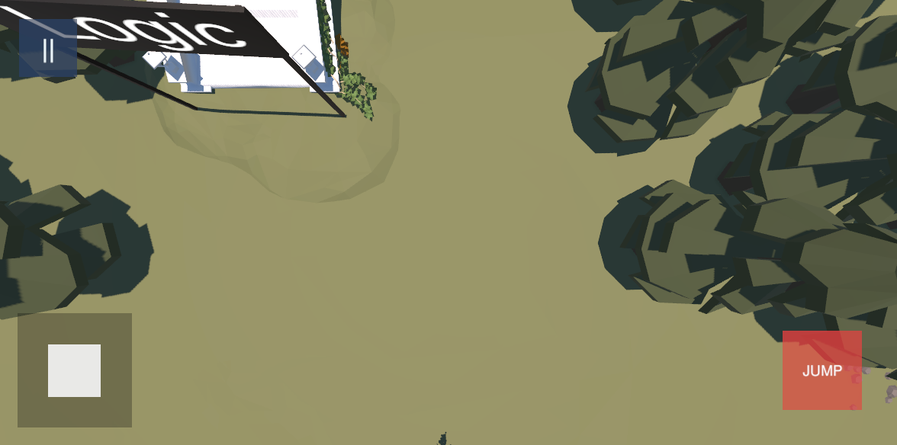 | 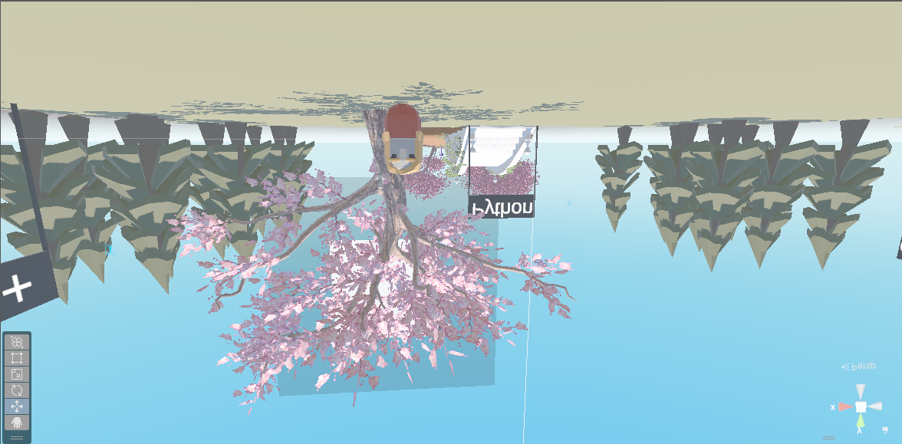 |

| World map | Python island | Python coding pad |
| --- | --- | --- |
|  |  |  |

### Android App And Web Creator

| Children dashboard | AI child insight | Goals | Task history |
| --- | --- | --- | --- |
| 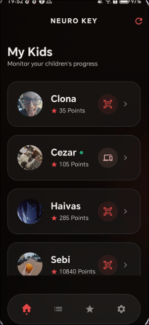 | 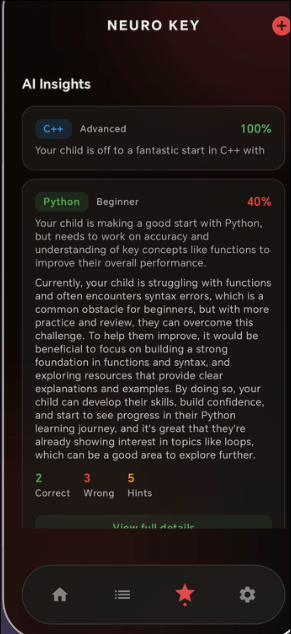 | 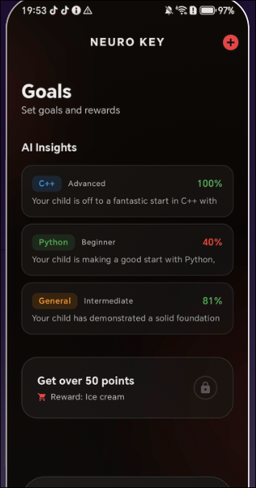 | 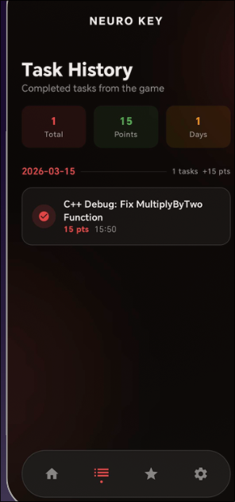 |

| Web creator dashboard | Course library/editor |
| --- | --- |
|  |  |

## Table Of Contents

- [System Architecture](#system-architecture)
- [Repository Structure](#repository-structure)
- [Technology Stack](#technology-stack)
- [Backend](#backend)
- [Binary Packet Encryption](#binary-packet-encryption)
- [Packet Reference](#packet-reference)
- [Authentication](#authentication)
- [Per-Student Learning Profile](#per-student-learning-profile)
- [AI System](#ai-system)
- [Secure Code Execution](#secure-code-execution)
- [Unity Game](#unity-game)
- [Android Parent App](#android-parent-app)
- [Web Course Creator](#web-course-creator)
- [Courses, Tasks, Goals, And Reports](#courses-tasks-goals-and-reports)
- [Database Model](#database-model)
- [Security Notes](#security-notes)
- [Running The Project](#running-the-project)
- [Current Testing State](#current-testing-state)

## System Architecture

Mentora uses a multi-client, single-backend architecture. The Java backend is the source of truth for identity, progress, AI profile data, course content, task completion, goals, and code execution. Unity and Android communicate with it through an encrypted binary WebSocket protocol. The web creator uses REST.

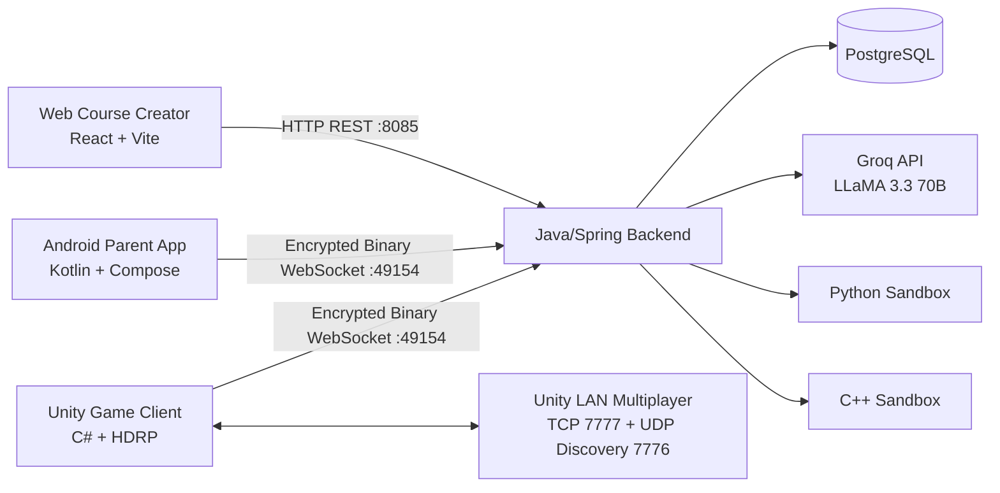

The Unity client also contains a second networking layer that is separate from the Java backend. `MultiplayerSessionManager.cs` handles LAN discovery, host/join sessions, remote avatars, quiz packets, voice chat, CodeWorld synchronization, and multiplayer profile sharing.

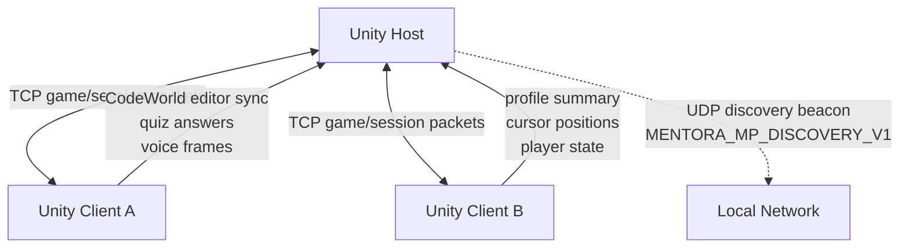

## Repository Structure

| Path | Purpose |
| --- | --- |
| `java-server/Java-Server/` | Spring Boot backend, WebSocket server, REST API, AI integration, code execution, persistence |
| `unity/` | Unity 2022.3.62f3 HDRP game client |
| `kotlin-app/` | Android parent dashboard built with Kotlin and Jetpack Compose |
| `web-creator/` | React/Vite course authoring platform |
| `images/` | Project screenshots used by this README and presentation material |
| `mentora-presentation-slidev/` | Slidev presentation assets |

## Technology Stack

| Layer | Technologies |
| --- | --- |
| Backend | Java 21, Spring Boot 3.2.4, Spring Data JPA, Hibernate, PostgreSQL |
| Realtime backend protocol | Java-WebSocket, custom encrypted binary packets |
| AI | Groq API, `llama-3.3-70b-versatile`, response cache, API key rotation |
| Code execution | Server-side Python and C++ runners with Linux sandboxing |
| Game | Unity 2022.3.62f3, C#, HDRP |
| Android | Kotlin, Jetpack Compose, CameraX, ZXing/QR scanning, Coil |
| Web | React 19, Vite 7, Tailwind CSS v4, Framer Motion, lucide-react |

## Backend

The backend is the central authority for the platform. It owns account data, child profiles, learning history, published courses, tasks, goals, live session state, parent challenges, weekly reports, AI calls, and code execution.

Important files:

| File | Role |
| --- | --- |
| `client/ClientHandler.java` | Main WebSocket packet dispatcher and authorization gate |
| `packet/Packet.java` | Base packet class, encryption/decryption, string serialization |
| `packet/PacketManager.java` | Packet factory for backend packet IDs |
| `database/services/LearningProfileService.java` | Per-child AI profile updates, summaries, weekly reports |
| `database/services/CourseService.java` | Course CRUD, publishing, completion, reward logic |
| `database/services/TaskService.java` | Global task seeding and task completion |
| `utility/GroqAI.java` | Groq chat API wrapper, response cache, key rotation |
| `python/PythonExecutor.java` | Sandboxed Python execution |
| `cpp/CppExecutor.java` | Sandboxed C++ compilation and execution |
| `web/WebAuthController.java` | Web auth endpoints |
| `web/WebCourseController.java` | Web course REST API |

`Server.java` keeps live runtime state:

- `activeConnections` for connected clients.
- `pendingQRLogins` for QR login pairing.
- `latestLiveSessionStates` for parent live monitoring.
- `liveSessionSpectators` for subscribed parent clients.
- `activeParentChallenges` for parent-sent challenges.

## Binary Packet Encryption

Unity and Android do not send plain JSON to the backend WebSocket. They use a custom binary packet format implemented in Java, C#, and Kotlin.

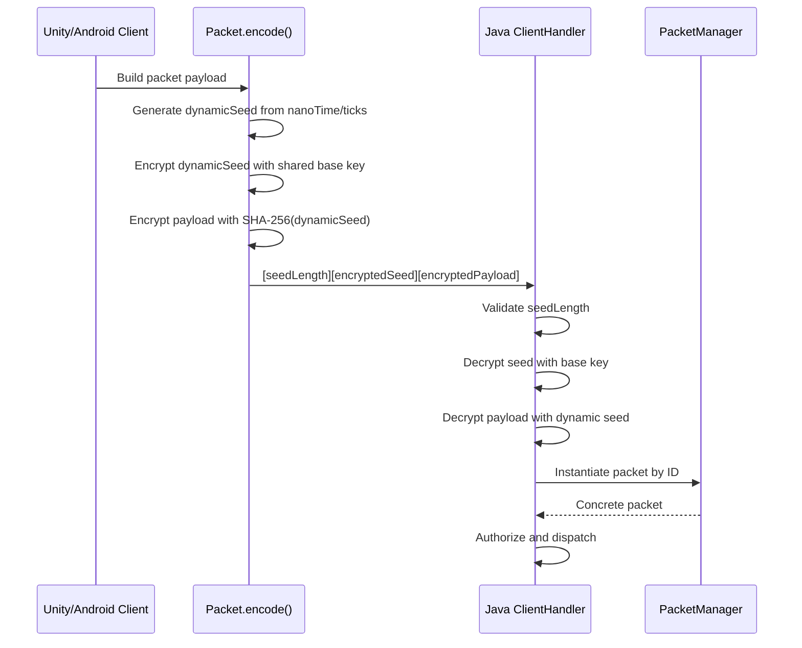

Frame layout:

```text
[4-byte seed length][encrypted seed][encrypted payload]
```

Encryption details confirmed in code:

- Algorithm: `AES/CBC/PKCS5Padding` on Java, `Aes` with `CBC` and `PKCS7` on C#.
- Key derivation: SHA-256 hash of the provided password/seed string.
- IV: random 16-byte IV prepended to ciphertext.
- Dynamic seed: generated per packet, encrypted with `Data.baseKey`, then used as the payload key.
- Defensive validation: seed length must be positive and no greater than `1024`.

String serialization inside packets uses:

```text
[int length][UTF-8 bytes]
```

## Packet Reference

There are two packet systems:

- Backend WebSocket packets, handled by `java-server/Java-Server/.../PacketManager.java`.
- Unity local multiplayer packets, handled by `unity/Assets/Scripts/Runtime/Network/PacketManager.cs`.

### Backend WebSocket Packets

| ID | Packet | Purpose |
| --- | --- | --- |
| `1` | `HandShakePacket` | Client identifies itself after WebSocket connection |
| `2` | `AuthPacket` | Parent login over WebSocket |
| `3` | `RegisterParentPacket` | Parent registration over WebSocket |
| `4` | `AddChildPacket` | Add child to authenticated parent |
| `5` | `AddGoalPacket` | Create child goal |
| `8` | `CompleteTaskPacket` | Mark task complete and award task points |
| `9` | `ActionResponsePacket` | Generic success/error response |
| `10` | `AuthResponsePacket` | Parent auth response |
| `11/12` | `FetchTasksPacket` / response | Global task catalog |
| `13/14` | `FetchGoalsPacket` / response | Goals for a child |
| `15/16` | `FetchChildrenPacket` / response | Parent children list and online flags |
| `17/18` | `FetchCompletedTasksPacket` / response | Completed task history |
| `19/20` | `GenerateQRLoginPacket` / response | QR login token creation |
| `21` | `ClaimQRLoginPacket` | Parent app claims QR token for child |
| `22` | `ChildAuthResponsePacket` | Game child login response |
| `23/24` | `FetchChildStatsPacket` / response | Child stats and game profile JSON |
| `25` | `VerifySessionPacket` | Resume game session |
| `26` | `UpdatePfpPacket` | Update parent or child profile picture |
| `27` | `RemoveChildPacket` | Delete child profile |
| `28/29` | `ExecuteCPPCodePacket` / response | Compile and run C++ |
| `30/31` | `AskAiPacket` / `AiResponsePacket` | AI mentor chat and evaluation |
| `32` | `FetchChildStatsByParentPacket` | Parent fetches child stats without updating streak |
| `33` | `RecordLearningEventPacket` | Write learning event into child profile |
| `34/35` | `ExecutePythonCodePacket` / response | Run Python |
| `36/37` | `FetchPublishedCoursesPacket` / response | Published course catalog |
| `38/39` | `FetchCourseDetailPacket` / response | Published course details |
| `40` | `SubmitCourseCompletionPacket` | Save course attempt and possible reward |
| `41/42` | `FetchAllChildrenPacket` / response | Dev/admin child listing |
| `43` | `DevLoginAsChildPacket` | Dev shortcut child login |
| `44` | `DevCreateChildProfilePacket` | Dev shortcut child creation |
| `45/46` | `GenerateAiTaskPacket` / response | AI-generated challenge |
| `47/48` | `CompanionSpeakPacket` / response | Companion text response |
| `58/59` | `CompanionVoiceTextPacket` / `CompanionVoiceAudioPacket` | Companion voice/text input |
| `64/65` | `SubscribeLiveSessionPacket` / `LiveSessionUpdatePacket` | Parent live session monitoring |
| `66/67/68` | Parent challenge packets | Parent sends challenge and receives completion |
| `69/70` | Weekly report packets | AI weekly parent report |
| `71/72` | Programming profile summary packets | Child profile summary for game/multiplayer context |

`ClientHandler.java` enforces an unauthenticated whitelist. Packets outside the allowed set return an unauthorized `ActionResponsePacket` unless the client has a valid parent or child session.

### Unity Local Multiplayer Packets

These packets are defined in the Unity client and belong to LAN multiplayer, not the Java backend:

| ID | Packet | Purpose |
| --- | --- | --- |
| `49/50` | `MultiplayerJoinPacket` / `MultiplayerWelcomePacket` | Join host session |
| `51/52` | `MultiplayerPlayerStatePacket` / `MultiplayerPlayerLeftPacket` | Remote player state |
| `53/54/55` | `QuizStartPacket` / `QuizAnswerPacket` / `QuizResultPacket` | Multiplayer quiz flow |
| `56/57` | `MultiplayerVoicePacket` / `MultiplayerUdpHelloPacket` | Voice and UDP discovery |
| `60/61` | `CodeWorldCommandPacket` / `CodeWorldStatePacket` | CodeWorld command and state sync |
| `62/63` | `CodeWorldEditorSyncPacket` / `CodeWorldCursorPacket` | Shared editor text and named cursors |
| `73` | `MultiplayerProfileSummaryPacket` | Per-player programming profile sharing |

## Authentication

Mentora has separate parent and child flows.

### Parent Auth

Parents can authenticate through Android WebSocket packets or through the web REST API. The web API exposes:

| Method | Endpoint | Purpose |
| --- | --- | --- |
| `POST` | `/api/web/auth/lookup` | Check whether an email exists |
| `POST` | `/api/web/auth/register` | Create parent and return token |
| `POST` | `/api/web/auth/login` | Login and return token |

Credentials are hashed with `SHA-256` in `HashUtility`. Web sessions are UUID tokens stored in memory by `WebSessionService` with a 7-day TTL.

### Child Auth Through QR

Children do not type credentials in the game. The game uses QR pairing:

1. Unity sends `GenerateQRLoginPacket`.
2. Backend returns a short token through `QRLoginResponsePacket`.
3. Parent scans the QR code from Android.
4. Android sends `ClaimQRLoginPacket` with token and child ID.
5. Backend sends `ChildAuthResponsePacket` to the waiting game client.
6. Unity stores child ID/session token and later resumes through `VerifySessionPacket`.

## Per-Student Learning Profile

Every child has a `game_stats` JSONB column in the `children` table. The profile is intentionally flexible and is maintained by `LearningProfileService`.

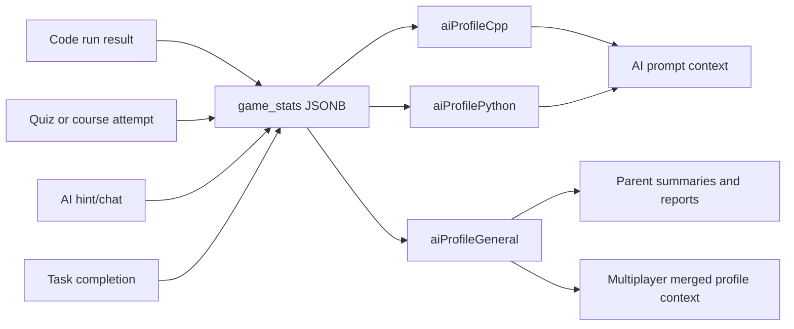

Tracked fields include:

- `correctCount`
- `incorrectCount`
- `hintsUsed`
- `chatTurns`
- `totalInteractions`
- topic statistics
- concept strengths and struggles
- common mistakes
- recent learning events
- `summaryText`
- `summaryOneLine`
- `summaryThreeLine`
- summary update timestamp

`recordLearningEvent()` updates language-specific and general profiles. `recordAiInteraction()` skips contexts containing `eval`, so AI grading does not inflate hint/chat usage.

`buildProfileSummary()` classifies the child as `beginner`, `intermediate`, or `advanced` based on interaction count and accuracy. `buildAiHelpProfileContext()` serializes the child profile into text for AI prompts. `buildMultiplayerProgrammingProfileSummary()` produces a compact profile string used by Unity multiplayer profile merging.

## AI System

The AI layer is centered around Groq and `llama-3.3-70b-versatile`.

Capabilities in the current codebase:

- AI mentor chat through `AskAiPacket`.
- AI-backed code evaluation contexts.
- AI-generated task/challenge flow through `GenerateAiTaskPacket`.
- AI companion lines through `CompanionSpeakPacket`.
- Companion voice input through transcript or PCM audio packets.
- Parent-facing summaries and weekly reports.
- Multiplayer quiz/profile context generation from merged player profiles.

`GroqAI.java` includes:

- 200-entry LRU response cache.
- 5-minute cache TTL.
- 35-second request timeout.
- API key rotation when keys timeout or hit retryable status codes.
- fallback error strings when no key is configured or Groq is unavailable.

## Secure Code Execution

Student code is executed server-side, but not directly in the backend process.

### Python

`PythonExecutor.java`:

- creates a temporary directory.
- writes code to `main.py`.
- runs `python3 -I -B -S`.
- isolates network/user namespace with `unshare --net --user --map-root-user`.
- applies strict `ulimit` constraints.
- deletes the temporary directory afterward.

### C++

`CppExecutor.java`:

- creates a temporary directory.
- writes code to `main.cpp`.
- compiles with `g++ -O2`.
- applies a compile timeout.
- runs the compiled binary through the same `unshare` and `ulimit` wrapper.
- deletes the temporary directory afterward.

Sandbox limits:

| Limit | Value |
| --- | --- |
| Virtual memory | `ulimit -v 262144` |
| CPU time | `ulimit -t <timeoutSeconds>` |
| Created file size | `ulimit -f 2048` |
| Process count | `ulimit -u 64` |
| Network | disabled through `unshare --net` |
| Java fallback timeout | `timeoutSeconds + 2` |

## Unity Game

The Unity game is the main student experience. It contains coding pads, quiz islands, community course browsing, AI challenges, a companion character, LAN multiplayer, and CodeWorld.

Important scripts:

| Script | Responsibility |
| --- | --- |
| `GameClient.cs` | WebSocket connection to backend and encrypted packet send/receive |
| `PauseMenuManager.cs` | UI hub, auth flow, multiplayer menus, CodeWorld and Quiz Island entry points |
| `MultiplayerSessionManager.cs` | LAN host/join, discovery, remote avatars, voice, quiz packets, profile sync |
| `CodeWorldRuntime.cs` | "Your Code Controls The World" editor and runtime scene modification |
| `MultiplayerQuizManager.cs` | Multiplayer quiz state, scoring, answer timing |
| `CommunityIslandMenu.cs` | Published course browsing and course quiz play |
| `AiChallengePad.cs` | AI-generated personalized challenge flow |
| `RobotCompanion.cs` | In-game companion behavior, text/voice triggers |
| `PythonDebugPadCinematic.cs` | Python challenges and AI evaluation flow |
| `CodeChallengePadCinematic.cs` | C++ coding/debugging pads |
| `CppQuestionPadCinematic.cs` | C++ multiple-choice quiz pad |

### CodeWorld

CodeWorld is accessible from `PauseMenuManager -> Multiplayer -> Host Game -> Your Code Controls The World`. It teleports the player to `CodeWorldRuntime.SpawnPosition` and activates a code editor that can show/hide in game.

Implemented behavior includes:

- code editor overlay/window.
- keyboard-driven command editing.
- object creation and manipulation through code-like commands.
- cubes, spheres, rectangles/circles style primitives depending on command support in `CodeWorldRuntime`.
- loops and command parsing support in the CodeWorld interpreter.
- local history and state serialization.
- live multiplayer editor sync.
- named remote cursors.
- snapshot resync for clients joining after the host.
- hiding the normal companion where appropriate for CodeWorld mode.

CodeWorld multiplayer packets are local Unity session packets:

- `CodeWorldCommandPacket`
- `CodeWorldStatePacket`
- `CodeWorldEditorSyncPacket`
- `CodeWorldCursorPacket`

### Quiz Island

Quiz Island is hosted through the multiplayer menu. It supports:

- host-controlled quiz options.
- fetching quiz/course content.
- AI profile quiz generation.
- multiplayer answer collection.
- response-time-aware scoring in `MultiplayerQuizManager`.
- ending the question once all players answer, with a short delay before moving on.
- merged programming profile context when multiple players are in the lobby.

### Multiplayer Profile Merging

`MultiplayerSessionManager` stores `ProgrammingProfileSnapshot` entries for local and remote players:

- `ClientId`
- `PlayerName`
- `ChildId`
- `ChildName`
- `TotalPoints`
- `Streak`
- `CompletedTaskCount`
- `TotalTaskCount`
- `ProfileSummary`

`BuildMergedProgrammingProfileContext()` combines available player profiles so AI-generated multiplayer quizzes can consider all participants, not only the host.

### Voice And Companion

The Unity game supports:

- companion text responses.
- voice transcript packets.
- raw PCM voice audio packets.
- local voice chat in multiplayer.
- voice modes: `AlwaysOn`, `PushToTalk`, `Muted`.
- contextual companion triggers like challenge success/failure and entering coding pads.

## Android Parent App

The Android app is a parental monitoring suite, not just a login client.

Key files:

| File | Responsibility |
| --- | --- |
| `MainActivity.kt` | Android entry point |
| `ui/AuthScreen.kt` | Parent login/register UI |
| `ui/MainDashboard.kt` | Compose dashboard, children, goals, history, settings |
| `ui/SocketViewModel.kt` | WebSocket state, packets, data models, notifications |
| `socket/ClientSocket.java` | WebSocket client |
| `socket/packet/Packet.java` | Packet serialization/encryption counterpart |

Implemented app features:

- parent login/register.
- reconnect loop.
- children dashboard with points and online state.
- QR scan flow for linking game sessions.
- child profile pictures.
- parent profile picture support.
- task history.
- goals.
- live session subscription state.
- AI profiles by language and general profile.
- weekly reports.
- system notifications when child activity arrives.
- theme customization and dark mode.

## Web Course Creator

The web creator lets parents or educators manage course content that appears in the Unity game.

Important files:

| File | Responsibility |
| --- | --- |
| `src/App.jsx` | Main SPA, auth state, dashboard, course editor |
| `src/lib/api.js` | REST API helper |
| `src/main.jsx` | React entry point |
| `src/styles.css` | Tailwind/CSS styling |

REST API:

| Method | Endpoint | Purpose |
| --- | --- | --- |
| `POST` | `/api/web/auth/lookup` | Determine login/register path |
| `POST` | `/api/web/auth/register` | Register parent |
| `POST` | `/api/web/auth/login` | Login parent |
| `GET` | `/api/web/courses/mine` | List owned courses |
| `GET` | `/api/web/courses/{courseId}` | Get owned course detail |
| `POST` | `/api/web/courses` | Create course |
| `PUT` | `/api/web/courses/{courseId}` | Update course and questions |
| `DELETE` | `/api/web/courses/{courseId}` | Delete course |

Course validation in `CourseService`:

- title is required.
- at least one quiz question is required.
- each question needs a prompt.
- each question has four options.
- `correctIndex` must be `0..3`.
- acronym is sanitized from acronym/title.
- summary is trimmed to 280 characters.
- course ownership is checked for read/update/delete.

## Courses, Tasks, Goals, And Reports

### Courses

Courses are authored in the web creator and played in Unity through Community Island.

Course fields:

- title.
- acronym.
- language.
- difficulty.
- summary.
- description.
- point reward.
- published flag.
- ordered quiz questions.

`recordCourseCompletion()` tracks attempts, last score, best score, total questions, last attempt time, completion, and reward state. Course points are granted only once because `rewardGranted` is checked before awarding points.

### Global Tasks

Global tasks are initialized from `DefaultTaskType`:

| Category | Examples |
| --- | --- |
| C++ starter | `C++ Starter Quiz: Complete All Questions` |
| C++ debug medium | multiply, sum, even check, pass-by-reference |
| C++ hard | `IsEven`, `MaxOfTwo`, `Square`, `Sum3`, `Factorial3` |
| Python medium | multiply, add, even check, loop sum |
| Python hard visual | bar line, progress bar, square grid, staircase, alternating pattern |
| Logic puzzles | jump power/physics, reveal island, reveal bridge |

`TaskService.completeTask()` creates a `CompletedTask`, adds the task point value to the child, increments `game_stats["tasks_completed"]`, saves the child, and triggers goal checks. The method currently does not enforce duplicate prevention in the shown code path, so callers should avoid submitting the same completion repeatedly unless repeat rewards are intended.

### Goals

Goals are parent-created child objectives. A goal can be based on:

- required points.
- required task.

`GoalService` checks goals after task completion and can push updates to connected clients.

### Parent Challenges

Parent challenges are live prompts sent from the Android app to a child session:

- `SendParentChallengePacket`
- `ParentChallengePacket`
- `ParentChallengeCompletedPacket`

Active challenges are held in `Server.activeParentChallenges`.

### Weekly Reports

`LearningProfileService.generateWeeklyParentReport()`:

- computes the current Monday-Sunday week.
- collects completed tasks from the week.
- reads C++, Python, and general profile data.
- collects recent learning events.
- builds an AI prompt for a parent-facing report.
- falls back to a deterministic report if the AI call fails.

## Database Model

The entity model is implemented under `java-server/Java-Server/src/main/java/io/github/kawase/database/entity/`.

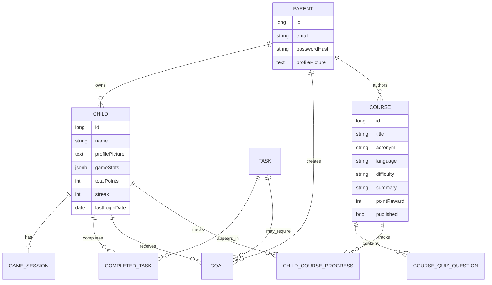

Important persistent concepts:

- `children.game_stats` stores the evolving AI profile as JSONB.
- `game_sessions` stores persistent child session tokens.
- `completed_tasks` stores task completion records.
- `goals` stores parent-created reward objectives.
- `child_course_progress` stores course attempts, scores, and reward state.

## Security Notes

Implemented protections:

- encrypted binary WebSocket packets between backend and Unity/Android.
- per-packet dynamic encryption seed.
- seed length validation.
- SHA-256 credential hashing.
- web bearer tokens with TTL.
- course owner validation.
- child ownership checks in parent operations.
- code execution sandboxing with process, memory, file, CPU, and network restrictions.

Known limitations visible in the code:

- web sessions are in-memory, so they reset when the backend restarts.
- password hashing uses plain SHA-256 rather than a slow password hashing algorithm such as BCrypt/Argon2.
- some dev/admin packets exist in the packet map and whitelist; deployments should review exposure before public release.
- task completion duplicate prevention is not enforced in `TaskService.completeTask()`.

## Running The Project

### Backend

```bash
cd java-server/Java-Server
./gradlew bootRun
```

Expected services:

- HTTP REST: `:8085`
- WebSocket: `:49154`

Backend prerequisites:

- Java 21.
- PostgreSQL.
- configured `application.properties`.
- `api-keys.json` with Groq API key configuration.

Example Groq key file:

```json
{
  "groq_api_keys": ["gsk_first_key", "gsk_second_key"]
}
```

### Web Creator

```bash
cd web-creator
npm install
npm run dev
```

Set `VITE_API_BASE` if the backend is not running at the default configured endpoint.

### Android App

Open `kotlin-app/` in Android Studio. The app targets modern Android SDKs and uses WebSocket packets matching the backend protocol.

### Unity Game

Open `unity/` in Unity Hub using Unity `2022.3.62f3`. Update the server URL in `GameClient.cs` if using a local backend instead of the deployed endpoint.

The default Unity backend URL in code is:

```text
wss://neuro.serenityutils.club
```

## Current Testing State

The repository currently does not contain a full automated test suite for all components. Verification is mainly manual/integration-based:

- backend starts and accepts WebSocket/REST traffic.
- Unity connects and exchanges encrypted packets.
- Android connects and displays child/progress state.
- web creator can authenticate and manage courses.
- Unity MCP was used to capture current game/editor screenshots for this README.

This is an important improvement area. The highest-value future tests would cover packet encoding/decoding compatibility, course completion reward rules, task duplicate behavior, learning profile updates, and code executor sandbox behavior.

## Competition/Project Criteria Mapping

Mentora matches common educational software evaluation criteria:

- Architecture: multi-client system with backend, game, mobile app, and web creator.
- Implementation: custom packet protocol, sandboxed code execution, AI profile service, multiplayer systems.
- Interface: game UI, Android dashboard, web authoring tool.
- Content: editable courses, coding tasks, quizzes, AI-generated challenges, live feedback.
- Evaluation and feedback: task completion, AI explanations, parent summaries, weekly reports.
- Originality: persistent per-student AI profile, collaborative CodeWorld, merged multiplayer programming context, live parent-child educational loop.
