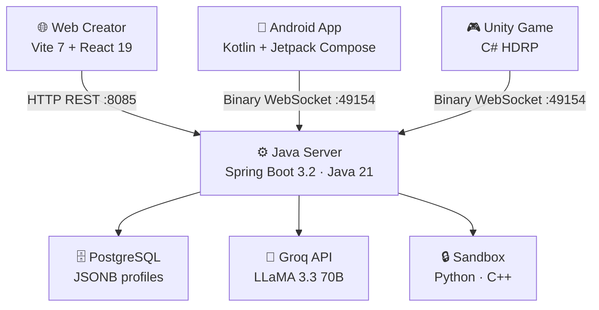
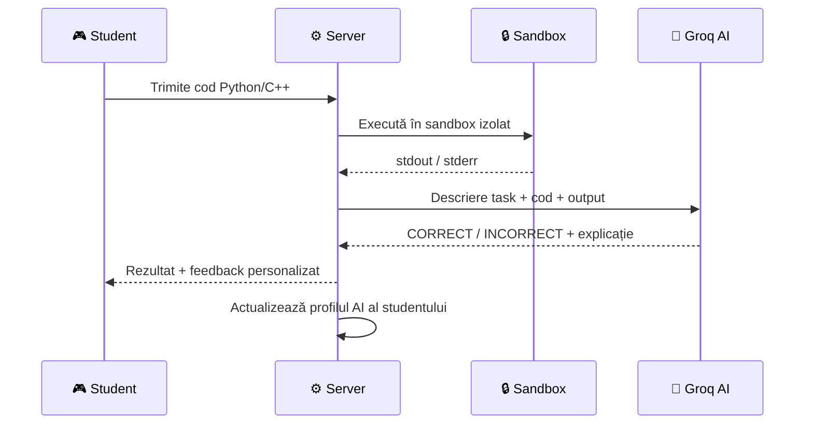

<div class="absolute inset-0" style="background: linear-gradient(135deg, rgba(124,58,237,0.75) 0%, rgba(16,185,129,0.45) 50%, rgba(0,0,0,0.7) 100%);" />

<div class="relative z-10 flex flex-col items-center justify-center h-full">
  
  <h1 style="font-family:'Space Grotesk',sans-serif; font-size:3.8rem; font-weight:800; color:white; letter-spacing:-0.02em; text-shadow: 0 2px 20px rgba(0,0,0,0.5);">Mentora</h1>
  <p style="font-size:1.2rem; color:rgba(255,255,255,0.88); margin-top:0.6rem; font-weight:300; letter-spacing:0.02em;">Platformă Educațională AI pentru Programare</p>
  <div class="mt-7 flex gap-3 flex-wrap justify-center">
    <span style="padding:0.35rem 1rem; border-radius:999px; background:rgba(124,58,237,0.55); color:white; font-size:0.93rem; border:1px solid rgba(167,139,250,0.5); backdrop-filter:blur(8px);">InfoEducație 2026</span>
    <span style="padding:0.35rem 1rem; border-radius:999px; background:rgba(16,185,129,0.4); color:white; font-size:0.93rem; border:1px solid rgba(52,211,153,0.4); backdrop-filter:blur(8px);">Secțiunea Software Educațional</span>
  </div>
</div>

<!--
Bun venit la prezentarea Mentora — o platformă educațională AI care îi ajută pe copii să învețe programare reală prin joc.
-->

---
layout: section
transition: fade-out
---

# Problema

---
layout: default
---

# De ce avem nevoie de Mentora?

<div class="grid grid-cols-2 gap-7 mt-5">
<div>

<p style="font-size:0.93rem; font-weight:600; color:#a78bfa; text-transform:uppercase; letter-spacing:0.08em; margin-bottom:0.5rem;">Situația actuală</p>


- Copiii 9–13 ani învață programare prin **drag-and-drop** (Scratch, Code.org)
- Trecerea la cod real este **bruscă și descurajantă**
- Platformele existente oferă feedback **static, neadaptiv**
- Părinții nu au **vizibilitate** asupra progresului real


</div>
<div>

<p style="font-size:0.93rem; font-weight:600; color:#34d399; text-transform:uppercase; letter-spacing:0.08em; margin-bottom:0.5rem;">Ce spune cercetarea</p>


- <span style="color:#a78bfa; font-weight:700;">Stanford CLT:</span> AI adaptiv → elevii învață de **1.5–2× mai rapid**
- <span style="color:#a78bfa; font-weight:700;">Stanford CLT:</span> reducere cu **45%** a abandonului
- <span style="color:#34d399; font-weight:700;">MDPI 2025:</span> +**58% retenție** față de cursuri statice
- <span style="color:#fbbf24; font-weight:700;">Hamari 2016:</span> provocarea prezice câștigurile (β = 0.348)


</div>
</div>

<!--
Problema centrală: există un gol între "programare vizuală pentru copii" și "cod real". Mentora umple acest gol cu un tutor AI adaptiv integrat într-un joc 3D.
-->

---
layout: section
transition: fade-out
---

# Ce este Mentora?

---
layout: default
---

# Ecosistemul Mentora — 4 Componente

<div class="grid grid-cols-2 gap-6 mt-4">

<div class="p-5 rounded-xl" style="border:1px solid rgba(124,58,237,0.4); background:linear-gradient(135deg,rgba(124,58,237,0.12),rgba(124,58,237,0.04));">
  <div class="text-3xl mb-2">🎮</div>
  <h3 class="font-bold" style="color:#a78bfa; font-size:1.08rem;">Joc Unity 3D</h3>
  <p style="font-size:0.93rem; color:#9ca3af; margin-top:0.3rem;">Lumea 3D HDRP unde copiii scriu cod Python și C++ real, rezolvă puzzle-uri și interacționează cu tutorul AI</p>
</div>

<div class="p-5 rounded-xl" style="border:1px solid rgba(16,185,129,0.4); background:linear-gradient(135deg,rgba(16,185,129,0.12),rgba(16,185,129,0.04));">
  <div class="text-3xl mb-2">📱</div>
  <h3 class="font-bold" style="color:#34d399; font-size:1.08rem;">Aplicație Android</h3>
  <p style="font-size:0.93rem; color:#9ca3af; margin-top:0.3rem;">Dashboard pentru părinți: prezență online, obiective, istoricul task-urilor, rezumate AI despre progresul copilului</p>
</div>

<div class="p-5 rounded-xl" style="border:1px solid rgba(59,130,246,0.4); background:linear-gradient(135deg,rgba(59,130,246,0.12),rgba(59,130,246,0.04));">
  <div class="text-3xl mb-2">🌐</div>
  <h3 class="font-bold" style="color:#60a5fa; font-size:1.08rem;">Web Creator</h3>
  <p style="font-size:0.93rem; color:#9ca3af; margin-top:0.3rem;">Instrument pentru educatori: creare cursuri quiz, publicare în joc, gestionare conținut educațional</p>
</div>

<div class="p-5 rounded-xl" style="border:1px solid rgba(245,158,11,0.4); background:linear-gradient(135deg,rgba(245,158,11,0.12),rgba(245,158,11,0.04));">
  <div class="text-3xl mb-2">⚙️</div>
  <h3 class="font-bold" style="color:#fbbf24; font-size:1.08rem;">Server Java</h3>
  <p style="font-size:0.93rem; color:#9ca3af; margin-top:0.3rem;">Backend Spring Boot: execuție cod în sandbox, AI adaptiv (LLaMA 3.3 70B via Groq), protocol binar WebSocket criptat</p>
</div>

</div>

---
layout: section
transition: fade-out
---

# Jocul Unity 3D

---
layout: image-right
image: /entire_map_in_game.png
---

# Lumea 3D — Harta Completă


- **Insulă Python** — provocări de debugging și vizualizare cod
- **Insulă C++** — task-uri starter, medium și hard
- **Insula Comunității** — cursuri publicate de educatori
- **Puzzle-uri logice** — manipulare variabile în joc (`jumpVelocity`, `islandVisible`, `boxRigidbody`)


<div style="margin-top:1.2rem; padding:0.6rem 0.9rem; border-radius:0.5rem; background:rgba(124,58,237,0.1); border:1px solid rgba(167,139,250,0.3); font-size:1.08rem;">
  <strong style="color:#a78bfa;">22 task-uri built-in</strong> progresive, organizate pe 3 niveluri de dificultate
</div>

<!--
Harta completă a jocului — fiecare insulă corespunde unui domeniu de programare.
-->

---
layout: image-left
image: /python_coding.png
---

# Coding Pad — Cod Real


- Studentul scrie **cod Python sau C++ real** — nu pseudocod, nu drag-and-drop
- Codul este trimis la server și **executat în sandbox securizat**
- Output-ul este evaluat de **LLaMA 3.3 70B** (Groq) — soluțiile creative sunt acceptate
- Tutorul AI știe **istoricul complet** al studentului înainte de fiecare răspuns


<div style="margin-top:0.8rem; padding:0.6rem 0.9rem; border-radius:0.5rem; background:rgba(16,185,129,0.1); border:1px solid rgba(52,211,153,0.3); font-size:0.93rem;">
  Nu există răspunsuri hardcodate — orice soluție corectă este acceptată
</div>

---
layout: section
transition: fade-out
---

# Aplicația Android

---
layout: two-cols
---

::default::

# Dashboard Părinți


- **Prezență online** în timp real per copil
- **Obiective personalizate** — prag de puncte sau task specific
- **Notificări push** la atingerea obiectivului
- **Scanare QR** (ML Kit + CameraX) pentru conectarea contului copilului
- **Streak zilnic** și bara de progres
- **Dark mode** și teme de culoare personalizabile


::right::

<div class="flex flex-col gap-3 mt-2">
  
  
</div>

---
layout: two-cols
---

::default::

# Profil AI al Copilului


- Rezumate AI generate pentru **C++**, **Python** și **General**
- Trei niveluri de detaliu: **1 linie**, **3 linii**, **complet**
- Istoricul task-urilor grupat pe **dată**
- Profilul reflectă efortul real — interacțiunile de evaluare AI **nu** inflațează contoarele


::right::

<div class="flex flex-col gap-3 mt-2">
  
  
</div>

---
layout: section
transition: fade-out
---

# Web Creator

---
layout: image-right
image: /web_creator.png
---

# Creare Cursuri pentru Educatori


- **CRUD complet** pentru cursuri: titlu, limbaj, dificultate, descriere, puncte
- Fiecare întrebare are **4 variante**, răspuns corect și explicație opțională
- **Publicare/retragere** — cursul apare instant în joc
- Completarea unui curs actualizează **profilul AI adaptiv** al studentului
- Autentificare cu **token Bearer** (TTL 7 zile)


<div style="margin-top:0.8rem; padding:0.6rem 0.9rem; border-radius:0.5rem; background:rgba(245,158,11,0.1); border:1px solid rgba(251,191,36,0.3); font-size:0.93rem;">
  Completare 100% obligatorie — orice răspuns greșit anulează recompensa
</div>

---
layout: section
transition: fade-out
---

# I. Arhitectura Aplicației

---
layout: default
---

# Arhitectura Tehnică



<div class="grid grid-cols-3 gap-3 mt-4" style="font-size:0.93rem;">
  <div class="p-2 rounded-lg text-center" style="background:rgba(124,58,237,0.12); border:1px solid rgba(124,58,237,0.35);">
    <div style="color:#a78bfa; font-weight:700; margin-bottom:2px;">Backend</div>
    Java 21 · Spring Boot 3.2<br/>Spring Data JPA · Hibernate
  </div>
  <div class="p-2 rounded-lg text-center" style="background:rgba(16,185,129,0.12); border:1px solid rgba(16,185,129,0.35);">
    <div style="color:#34d399; font-weight:700; margin-bottom:2px;">Mobile</div>
    Kotlin · Jetpack Compose<br/>Target SDK 36 · ML Kit
  </div>
  <div class="p-2 rounded-lg text-center" style="background:rgba(59,130,246,0.12); border:1px solid rgba(59,130,246,0.35);">
    <div style="color:#60a5fa; font-weight:700; margin-bottom:2px;">Web</div>
    Vite 7 · React 19<br/>Tailwind CSS · Framer Motion
  </div>
</div>

---
layout: two-cols
layoutClass: gap-8
---

::default::

# Portabilitate

Mentora rulează pe **orice platformă majoră** fără modificări de cod.


| Componentă | Platforme |
|---|---|
| Server Java | Windows · macOS · Linux |
| Joc Unity | Windows · macOS · Linux |
| Aplicație Android | Android 7.0+ (API 24+) |
| Web Creator | Orice browser modern |


<div style="margin-top:1.4rem; display:grid; grid-template-columns:repeat(3,1fr); gap:0.6rem; font-size:0.90rem;">
  <div style="padding:0.5rem 0.7rem; border-radius:0.5rem; background:rgba(124,58,237,0.1); border:1px solid rgba(167,139,250,0.25);">
    <span style="color:#a78bfa; font-weight:700;">Java 21 LTS</span><br/>Portabil pe orice JVM
  </div>
  <div style="padding:0.5rem 0.7rem; border-radius:0.5rem; background:rgba(16,185,129,0.1); border:1px solid rgba(52,211,153,0.25);">
    <span style="color:#34d399; font-weight:700;">Unity Cross-Platform</span><br/>Windows, macOS, Linux build
  </div>
  <div style="padding:0.5rem 0.7rem; border-radius:0.5rem; background:rgba(59,130,246,0.1); border:1px solid rgba(96,165,250,0.25);">
    <span style="color:#60a5fa; font-weight:700;">Web Standard</span><br/>Orice browser modern
  </div>
</div>

::right::

<div style="margin-top:0.5rem;">

### Tehnologii alese strategic

- **Java 21** — LTS, portabil, ecosistem matur
- **Unity HDRP** — cross-platform, grafică de calitate
- **Kotlin + Compose** — standard modern Android
- **Vite + React 19** — build rapid, orice browser
- **PostgreSQL** — JSONB nativ pentru profiluri AI

</div>

<div style="margin-top:1rem; padding:0.6rem 0.8rem; border-radius:0.5rem; background:rgba(245,158,11,0.1); border:1px solid rgba(251,191,36,0.25); font-size:0.90rem;">
  <strong style="color:#fbbf24;">Deployment:</strong> serverul rulează live la <code>neuro.serenityutils.club</code> — proiect distribuit publicului
</div>

---
layout: section
transition: fade-out
---

# II. Implementarea Aplicației

---
layout: default
---

# Protocol Binar WebSocket — Securitate

<div class="grid grid-cols-2 gap-5 mt-3">
<div>

<p style="font-size:0.90rem; font-weight:700; color:#a78bfa; text-transform:uppercase; letter-spacing:0.07em; margin-bottom:0.4rem;">Format cadru</p>

```
[4 bytes: seed length]
[encrypted seed]
[encrypted payload]
```


- **AES-256-CBC** cu seed dinamic per-pachet
- Seed din `System.nanoTime()` — unic per cadru
- Atacuri de tip **replay imposibile**
- 44 pachete, dispatcher `switch` în `ClientHandler.java`


</div>
<div>

<p style="font-size:0.90rem; font-weight:700; color:#34d399; text-transform:uppercase; letter-spacing:0.07em; margin-bottom:0.4rem;">Whitelist pre-autentificare</p>

Pachete **1, 2, 3, 19, 25, 41, 43, 44** permise înainte de auth. Orice alt pachet → eroare de autorizare.

<p style="font-size:0.90rem; font-weight:700; color:#60a5fa; text-transform:uppercase; letter-spacing:0.07em; margin:0.7rem 0 0.3rem;">Autentificare REST</p>

- Parole hash-uite cu **SHA-256**
- Token-uri UUID cu **TTL 7 zile**
- Stocate in-memory (nu în baza de date)

</div>
</div>

<div style="margin-top:1.2rem; display:grid; grid-template-columns:repeat(3,1fr); gap:0.6rem; font-size:0.90rem;">
  <div style="padding:0.5rem 0.7rem; border-radius:0.5rem; background:rgba(124,58,237,0.1); border:1px solid rgba(167,139,250,0.25); text-align:center;">
    <div style="color:#a78bfa; font-weight:700;">AES-256-CBC</div>Criptare per-pachet
  </div>
  <div style="padding:0.5rem 0.7rem; border-radius:0.5rem; background:rgba(16,185,129,0.1); border:1px solid rgba(52,211,153,0.25); text-align:center;">
    <div style="color:#34d399; font-weight:700;">44 tipuri pachete</div>Switch expression Java 21
  </div>
  <div style="padding:0.5rem 0.7rem; border-radius:0.5rem; background:rgba(59,130,246,0.1); border:1px solid rgba(96,165,250,0.25); text-align:center;">
    <div style="color:#60a5fa; font-weight:700;">SHA-256 + UUID</div>Auth securizat REST
  </div>
</div>

---
layout: default
---

# Sandbox Execuție Cod — Securitate

<div class="grid grid-cols-2 gap-5 mt-3">
<div>

<p style="font-size:0.90rem; font-weight:700; color:#a78bfa; text-transform:uppercase; letter-spacing:0.07em; margin-bottom:0.4rem;">Constrângeri sandbox</p>

```bash
unshare --net       # izolare rețea completă
ulimit -v 262144    # 256 MB memorie
ulimit -f 2048      # 2 MB fișiere max
ulimit -u 64        # 64 procese (anti fork-bomb)
timeout 120s        # + 2s grace period
```

</div>
<div>

<p style="font-size:0.90rem; font-weight:700; color:#34d399; text-transform:uppercase; letter-spacing:0.07em; margin-bottom:0.4rem;">Ce previne</p>

- **Exfiltrare date** — fără acces la rețea
- **Fork bombs** — limită de procese
- **Epuizare disc** — limită fișiere
- **Blocare server** — timeout strict
- **Overflow memorie** — limită RAM

<div style="margin-top:0.6rem; padding:0.5rem 0.8rem; border-radius:0.5rem; background:rgba(16,185,129,0.1); border:1px solid rgba(52,211,153,0.3); font-size:0.90rem;">
  Aplicația nu este expusă la vulnerabilități de execuție cod arbitrar
</div>

</div>
</div>

<div style="margin-top:1.2rem; display:grid; grid-template-columns:repeat(4,1fr); gap:0.5rem; font-size:1.02rem; text-align:center;">
  <div style="padding:0.7rem; border-radius:0.5rem; background:rgba(124,58,237,0.1); border:1px solid rgba(167,139,250,0.25);">
    <div style="color:#a78bfa; font-weight:700;">256 MB</div>RAM max
  </div>
  <div style="padding:0.7rem; border-radius:0.5rem; background:rgba(245,158,11,0.1); border:1px solid rgba(251,191,36,0.25);">
    <div style="color:#fbbf24; font-weight:700;">64</div>procese max
  </div>
  <div style="padding:0.7rem; border-radius:0.5rem; background:rgba(59,130,246,0.1); border:1px solid rgba(96,165,250,0.25);">
    <div style="color:#60a5fa; font-weight:700;">120s</div>timeout
  </div>
  <div style="padding:0.7rem; border-radius:0.5rem; background:rgba(16,185,129,0.1); border:1px solid rgba(52,211,153,0.25);">
    <div style="color:#34d399; font-weight:700;">0</div>acces rețea
  </div>
</div>

---
layout: default
---

# Calitatea Implementării

<div class="grid grid-cols-2 gap-5 mt-3">
<div>


<p style="font-size:0.90rem; font-weight:700; color:#a78bfa; text-transform:uppercase; letter-spacing:0.07em; margin-bottom:0.3rem;">Eleganța codului</p>

- Pattern-uri Spring Boot (DI, JPA repositories, `@Transactional`)
- Jetpack Compose cu ViewModel + StateFlow
- React 19 cu hooks și componente funcționale
- Dispatcher pachete cu `switch` expression (Java 21)

<p style="font-size:0.90rem; font-weight:700; color:#34d399; text-transform:uppercase; letter-spacing:0.07em; margin:0.6rem 0 0.3rem;">Gestionare cod</p>

- Proiect versionat cu **Git** pe tot parcursul dezvoltării
- Istoric complet de commit-uri documentat


</div>
<div>


<p style="font-size:0.90rem; font-weight:700; color:#60a5fa; text-transform:uppercase; letter-spacing:0.07em; margin-bottom:0.3rem;">Maturitate</p>

- Serverul rulează în producție la `neuro.serenityutils.club`
- Aplicația Android funcțională pe dispozitive reale
- Jocul Unity testat pe Windows și macOS

<p style="font-size:0.90rem; font-weight:700; color:#fbbf24; text-transform:uppercase; letter-spacing:0.07em; margin:0.6rem 0 0.3rem;">Cache & Rate limiting</p>

- LRU cache 200 intrări, TTL 5 min pentru Groq
- Cooldown 60s după rate limit
- Rezumate AI throttled la 1 per 5 min per copil


</div>
</div>

<div style="margin-top:1.2rem; display:grid; grid-template-columns:repeat(3,1fr); gap:0.6rem; font-size:1.02rem; text-align:center;">
  <div style="padding:0.7rem 0.9rem; border-radius:0.5rem; background:rgba(16,185,129,0.1); border:1px solid rgba(52,211,153,0.25);">
    <div style="color:#34d399; font-weight:700;">Producție live</div>neuro.serenityutils.club
  </div>
  <div style="padding:0.7rem 0.9rem; border-radius:0.5rem; background:rgba(124,58,237,0.1); border:1px solid rgba(167,139,250,0.25);">
    <div style="color:#a78bfa; font-weight:700;">Git versionat</div>Istoric complet commits
  </div>
  <div style="padding:0.7rem 0.9rem; border-radius:0.5rem; background:rgba(245,158,11,0.1); border:1px solid rgba(251,191,36,0.25);">
    <div style="color:#fbbf24; font-weight:700;">LRU 200 intrări</div>Cache răspunsuri AI
  </div>
</div>

---
layout: section
transition: fade-out
---

# III. Interfața

---
layout: image-right
image: /game_picture.png
---

# Interfața Jocului Unity


- **Unity HDRP** — grafică de înaltă calitate, iluminare volumetrică
- UI intuitiv: coding pad, bara de progres, chat AI accesibile direct din joc
- **Bilingv** — română și engleză, comutare din setări
- Animații cinematice la tranziții (Cinemachine)
- Personaj 3D animat (robot Copernicus)


<div style="margin-top:0.8rem; padding:0.6rem 0.9rem; border-radius:0.5rem; background:rgba(124,58,237,0.1); border:1px solid rgba(167,139,250,0.3); font-size:0.93rem;">
  Interfața se adaptează la rezoluții multiple — testat pe 1080p și 1440p
</div>

---
layout: two-cols
layoutClass: gap-6
---

::default::

# Interfața App & Web Creator


**Aplicație Android**
- Material Design 3 cu Jetpack Compose
- **Dark mode** nativ
- Teme de culoare personalizabile
- Navigare intuitivă cu bottom navigation
- Responsive pe toate dimensiunile de ecran Android

**Web Creator**
- Design curat, minimal
- Responsive — funcționează pe desktop și tabletă
- Formulare cu validare în timp real
- Feedback vizual la acțiuni (loading states, erori)


::right::

<div class="flex flex-col gap-3 mt-2">
  
  
</div>

---
layout: section
transition: fade-out
---

# IV. Conținut

---
layout: image-right
image: /ai_python.png
---

# Sistemul AI Adaptiv — Amprenta de Învățare

Fiecare copil are un **profil JSONB** în PostgreSQL cu trei sub-profile: C++, Python, General.


```json
{
  "correctCount": 14,
  "incorrectCount": 7,
  "hintsUsed": 5,
  "chatTurns": 12,
  "topics": {
    "python_course:LOOPS": { "correct": 4, "incorrect": 1 }
  },
  "recentEvents": [ ... ],
  "summaryText": "Stăpânire bună a buclelor..."
}
```


<div style="margin-top:0.6rem; padding:0.5rem 0.8rem; border-radius:0.5rem; background:rgba(124,58,237,0.1); border:1px solid rgba(167,139,250,0.3); font-size:0.90rem;">
  <strong style="color:#a78bfa;">Clasificare automată:</strong> Beginner (&lt;10 interacțiuni sau &lt;40% acuratețe) · Intermediate (40–70%) · Advanced (&gt;70%)
</div>

---
layout: default
---

# Fluxul de Evaluare a Codului



<div style="margin-top:0.6rem; padding:0.5rem 0.8rem; border-radius:0.5rem; background:rgba(16,185,129,0.1); border:1px solid rgba(52,211,153,0.3); font-size:0.90rem;">
  Soluțiile creative sunt acceptate — AI-ul judecă corectitudinea, nu potrivirea cu un șablon
</div>

---
layout: two-cols
layoutClass: gap-6
---

::default::

# Cursuri & Quiz — Conținut Gestionabil


- Educatorii creează cursuri din **Web Creator**
- Fiecare curs: titlu, limbaj, dificultate, descriere, puncte
- Întrebări cu **4 variante** + explicație opțională
- Publicare → apare instant pe **Insula Comunității** în joc
- Completare **100%** obligatorie pentru puncte
- Rezultatele actualizează **profilul AI** al studentului (topic accuracy map)


::right::


---
layout: default
---

# Sistem Obiective, Streak & Progres

<div class="grid grid-cols-3 gap-4 mt-5">

<div class="p-4 rounded-xl text-center" style="border:1px solid rgba(124,58,237,0.4); background:linear-gradient(135deg,rgba(124,58,237,0.12),rgba(124,58,237,0.04));">
  <div style="font-size:2.2rem; margin-bottom:0.5rem;">🎯</div>
  <h3 style="font-weight:700; color:#a78bfa; font-size:1.02rem;">Obiective Personalizate</h3>
  <p style="font-size:0.90rem; color:#9ca3af; margin-top:0.4rem;">Părinții setează un prag de puncte sau un task specific. Notificare push la atingere.</p>
</div>

<div class="p-4 rounded-xl text-center" style="border:1px solid rgba(245,158,11,0.4); background:linear-gradient(135deg,rgba(245,158,11,0.12),rgba(245,158,11,0.04));">
  <div style="font-size:2.2rem; margin-bottom:0.5rem;">🔥</div>
  <h3 style="font-weight:700; color:#fbbf24; font-size:1.02rem;">Streak Zilnic</h3>
  <p style="font-size:0.90rem; color:#9ca3af; margin-top:0.4rem;">Actualizat la fiecare sesiune de joc. <code>FetchChildStatsPacket</code> actualizează streak-ul; versiunea pentru părinți nu.</p>
</div>

<div class="p-4 rounded-xl text-center" style="border:1px solid rgba(16,185,129,0.4); background:linear-gradient(135deg,rgba(16,185,129,0.12),rgba(16,185,129,0.04));">
  <div style="font-size:2.2rem; margin-bottom:0.5rem;">📊</div>
  <h3 style="font-weight:700; color:#34d399; font-size:1.02rem;">Progres în Timp Real</h3>
  <p style="font-size:0.90rem; color:#9ca3af; margin-top:0.4rem;">Bara de progres în joc, istoricul task-urilor în app, rezumate AI generate la fiecare 5 minute.</p>
</div>

</div>

---
layout: section
transition: fade-out
---

# V. Originalitate și Inovație

---
layout: default
---

# Mentora vs. Soluțiile Existente

<div class="mt-4">

| Criteriu | Scratch / Code.org | Mentora |
|---|---|---|
| Tip cod | Drag-and-drop / blocuri | **Cod real Python & C++** |
| Feedback | Static, predefinit | **AI adaptiv, personalizat** |
| Profil student | Nu există | **JSONB cu 10+ metrici per limbaj** |
| Evaluare cod | Potrivire șablon | **LLM judecă corectitudinea** |
| Ecosistem | Platformă web | **Joc 3D + App + Web + Server** |
| Vizibilitate părinți | Minimă | **Dashboard complet + obiective** |
| Conținut | Fix | **Extensibil de educatori** |

</div>

<div style="margin-top:0.8rem; padding:0.6rem 0.9rem; border-radius:0.5rem; background:rgba(59,130,246,0.1); border:1px solid rgba(96,165,250,0.3); font-size:0.93rem;">
  <strong style="color:#60a5fa;">Inovația cheie:</strong> primul ecosistem complet (joc 3D + app părinți + web creator) cu tutor AI Socratic care cunoaște istoricul complet al fiecărui student
</div>

---
layout: default
---

# Fundament Științific

<div class="grid grid-cols-2 gap-6 mt-4" style="font-size:1.08rem;">
<div>


<div style="margin-bottom:0.8rem;">
<span style="font-size:0.85rem; font-weight:700; color:#a78bfa; text-transform:uppercase; letter-spacing:0.06em;">Stanford CLT (2024–2026)</span>
<ul style="margin-top:0.3rem; padding-left:1rem;">
<li>AI adaptiv → <strong>1.5–2× mai rapid</strong> la concepte cheie</li>
<li>Reducere cu <strong>45%</strong> a abandonului din frustrare</li>
<li>Eficient prin scaffolding "just-in-time"</li>
</ul>
</div>

<div>
<span style="font-size:0.85rem; font-weight:700; color:#34d399; text-transform:uppercase; letter-spacing:0.06em;">MDPI Education Sciences (2025)</span>
<ul style="margin-top:0.3rem; padding-left:1rem;">
<li><strong>+58% retenție</strong> față de cursuri statice (6 luni)</li>
<li>Avantaj de <strong>0.86 SD</strong> la evaluări finale</li>
<li>AI reduce anxietatea la programatori novici</li>
</ul>
</div>


</div>
<div>


<div style="margin-bottom:0.8rem;">
<span style="font-size:0.85rem; font-weight:700; color:#60a5fa; text-transform:uppercase; letter-spacing:0.06em;">CodeTutor Field Study — L@S 2024</span>
<ul style="margin-top:0.3rem; padding-left:1rem;">
<li><strong>+15–20%</strong> la scoruri post-test</li>
<li><strong>25% mai puține erori</strong> de sintaxă</li>
<li>Corelație Socratică: r ≈ 0.45</li>
</ul>
</div>

<div>
<span style="font-size:0.85rem; font-weight:700; color:#fbbf24; text-transform:uppercase; letter-spacing:0.06em;">Hamari et al. (2016)</span>
<ul style="margin-top:0.3rem; padding-left:1rem;">
<li>Provocare → câștiguri: <strong>β = 0.348, p &lt; 0.001</strong></li>
<li>Engagement mediază performanța: <strong>β = 0.368</strong></li>
<li>Susține dificultatea progresivă din Mentora</li>
</ul>
</div>


</div>
</div>

---
layout: section
transition: fade-out
---

# VI. Prezentarea Proiectului

---
layout: default
---

# Documentație & Instalare

<div class="grid grid-cols-2 gap-5 mt-3">
<div>

<p style="font-size:0.90rem; font-weight:700; color:#a78bfa; text-transform:uppercase; letter-spacing:0.07em; margin-bottom:0.4rem;">Cerințe sistem</p>


- **Java 21** (JDK)
- **PostgreSQL** (baza de date)
- `api-keys.json` cu cheia Groq
- `application.properties` cu credențiale DB
- **Android Studio** (Hedgehog+) pentru app
- **Unity Hub** + Unity 2022.3.62f3 pentru joc
- **Node.js 18+** pentru web creator


</div>
<div>

<p style="font-size:0.90rem; font-weight:700; color:#34d399; text-transform:uppercase; letter-spacing:0.07em; margin-bottom:0.4rem;">Pornire rapidă</p>

```bash
# Backend
cd java-server/Java-Server
./gradlew bootRun
# HTTP :8085 · WebSocket :49154

# Web Creator
cd web-creator && npm install
npm run dev  # http://localhost:5173

# Android — deschide kotlin-app/ în Android Studio
# Unity — deschide unity/ în Unity Hub
```

</div>
</div>

<div style="margin-top:1.2rem; display:grid; grid-template-columns:repeat(4,1fr); gap:0.5rem; font-size:1.02rem; text-align:center;">
  <div style="padding:0.7rem; border-radius:0.5rem; background:rgba(124,58,237,0.1); border:1px solid rgba(167,139,250,0.25);">
    <div style="color:#a78bfa; font-weight:700;">:8085</div>HTTP REST
  </div>
  <div style="padding:0.7rem; border-radius:0.5rem; background:rgba(16,185,129,0.1); border:1px solid rgba(52,211,153,0.25);">
    <div style="color:#34d399; font-weight:700;">:49154</div>Binary WS
  </div>
  <div style="padding:0.7rem; border-radius:0.5rem; background:rgba(59,130,246,0.1); border:1px solid rgba(96,165,250,0.25);">
    <div style="color:#60a5fa; font-weight:700;">:5173</div>Web Creator
  </div>
  <div style="padding:0.7rem; border-radius:0.5rem; background:rgba(245,158,11,0.1); border:1px solid rgba(251,191,36,0.25);">
    <div style="color:#fbbf24; font-weight:700;">GitHub</div>Cod sursă public
  </div>
</div>

---
layout: center
class: text-center
---

# De la consum pasiv la stăpânire activă

<div style="margin-top:1.2rem; font-size:1rem; color:#9ca3af; max-width:36rem; margin-left:auto; margin-right:auto; line-height:1.6;">
  Mentora nu predă programare — <strong style="color:white;">o face să fie trăită</strong>.<br/>
  Fiecare linie de cod, fiecare hint, fiecare task rezolvat<br/>
  construiește un profil unic care ghidează tutorul AI.
</div>

<div style="margin-top:2rem; display:flex; gap:1rem; justify-content:center; flex-wrap:wrap;">
  <div style="padding:0.6rem 1.2rem; border-radius:0.75rem; background:rgba(124,58,237,0.2); border:1px solid rgba(167,139,250,0.4); text-align:center;">
    <div style="font-size:1.6rem; font-weight:800; color:#a78bfa;">22</div>
    <div style="font-size:0.85rem; color:#9ca3af;">task-uri built-in</div>
  </div>
  <div style="padding:0.6rem 1.2rem; border-radius:0.75rem; background:rgba(16,185,129,0.2); border:1px solid rgba(52,211,153,0.4); text-align:center;">
    <div style="font-size:1.6rem; font-weight:800; color:#34d399;">44</div>
    <div style="font-size:0.85rem; color:#9ca3af;">tipuri de pachete</div>
  </div>
  <div style="padding:0.6rem 1.2rem; border-radius:0.75rem; background:rgba(59,130,246,0.2); border:1px solid rgba(96,165,250,0.4); text-align:center;">
    <div style="font-size:1.6rem; font-weight:800; color:#60a5fa;">4</div>
    <div style="font-size:0.85rem; color:#9ca3af;">componente integrate</div>
  </div>
  <div style="padding:0.6rem 1.2rem; border-radius:0.75rem; background:rgba(245,158,11,0.2); border:1px solid rgba(251,191,36,0.4); text-align:center;">
    <div style="font-size:1.6rem; font-weight:800; color:#fbbf24;">70B</div>
    <div style="font-size:0.85rem; color:#9ca3af;">parametri model AI</div>
  </div>
</div>

<div style="margin-top:2rem;">
  
  <p style="color:#6b7280; font-size:0.90rem; margin-top:0.5rem;">InfoEducație 2026 · Secțiunea Software Educațional</p>
</div>

<!--
Mulțumim pentru atenție. Mentora este disponibil pentru demonstrație live.
-->
