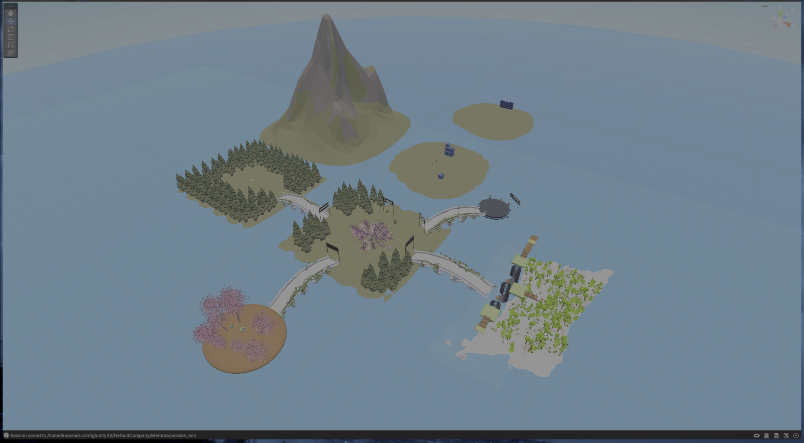
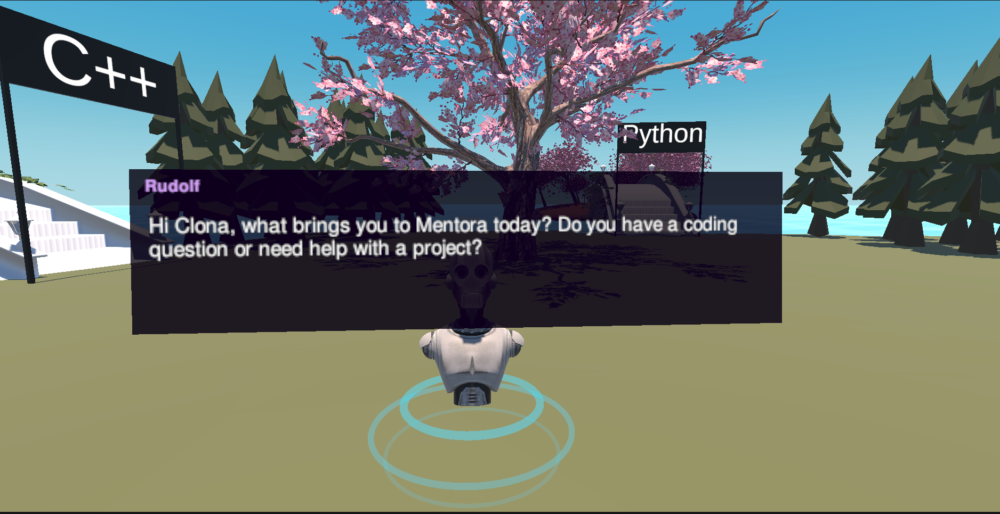
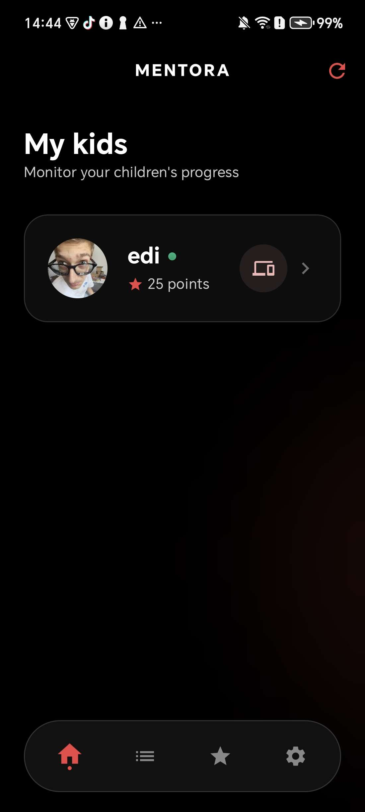
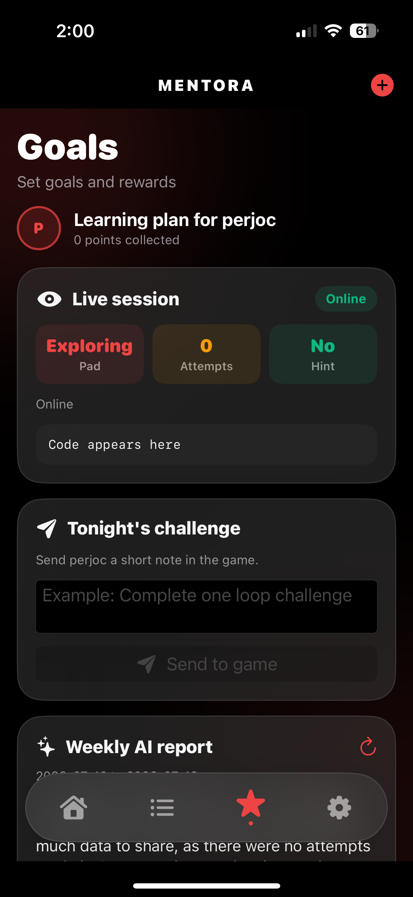
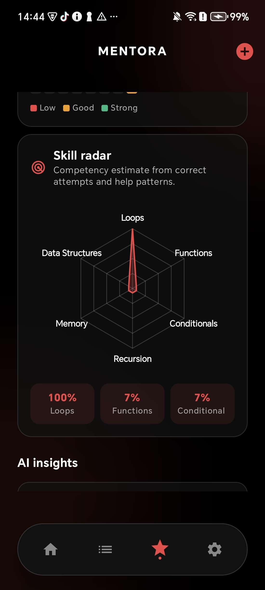
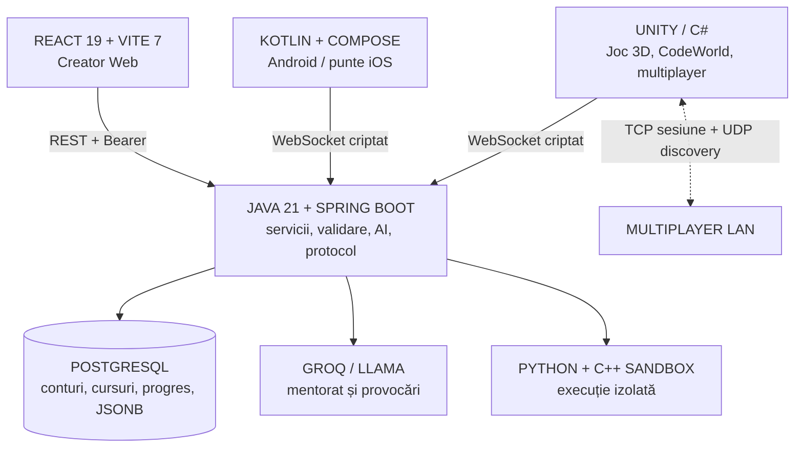

Persoana 1

  
Prezentare proiect · Software educațional

  <h1 class="cover-title">Mentora.</h1>
  
Ecosistem educațional în care elevul scrie cod real, îl vede în acțiune într-o lume 3D și primește feedback adaptat progresului său.

<!--
PERSOANA 1: Bună ziua. Vă prezentăm Mentora, un ecosistem educațional pentru învățarea practică a programării. Nu este doar un joc și nu este doar o aplicație: leagă elevul, părintele și creatorul de conținut într-un singur circuit de învățare.
-->

---

Persoana 1

Problema și soluția

# De la „corect sau greșit” la învățare vizibilă

  

    01 / PROBLEMĂ
    <h2>Problema</h2>
    
Elevul primește frecvent exerciții identice și feedback minimal. Programarea rămâne abstractă, iar părintele vede prea puțin din procesul real de învățare.

  

  

    02 / SOLUȚIE
    <h2>Soluția Mentora</h2>
    
Cod real, provocări 3D, evaluare automată, explicații AI, profil persistent, conținut actualizabil și legătura directă părinte–copil–creator.

  

  
01<strong>Scrie</strong>Python sau C++

  
02<strong>Rulează</strong>în mediu controlat

  
03<strong>Observă</strong>efectul în lume

  
04<strong>Înțelege</strong>feedback și indicii

  
05<strong>Evoluează</strong>profil personalizat

<!--
PERSOANA 1: Ideea centrală este ca elevul să fie activ. El formulează soluția, o testează, vede rezultatul, primește explicații și își poate corecta soluția. Astfel, greșeala devine parte din procesul de învățare.
-->

---

Persoana 2

Ecosistemul Mentora

# Patru componente, un singur parcurs educațional

  
01 / PLAY<h3>Joc Unity</h3>
Explorare 3D, coding pads, quiz-uri, Code Quest, CodeWorld, Rudolf și multiplayer LAN.

  
02 / TRACK<h3>Aplicație parentală</h3>
QR, progres, obiective, profil AI, raport săptămânal și sesiune live.

  
03 / CREATE<h3>Creator Web</h3>
Crearea, editarea și publicarea cursurilor și quiz-urilor pentru Community Island.

  
04 / CONNECT<h3>Backend central</h3>
Autentificare, persistență, AI, execuție securizată de cod și comunicare în timp real.

  
3roluri: elev, părinte, creator

  
4interfețe în română, engleză, franceză, germană

  
500+commit-uri Git cumulate în mai multe repository-uri

<!--
PERSOANA 2: Mentora nu funcționează ca aplicații izolate. Un curs creat în web apare în joc, progresul elevului este salvat de server, iar părintele îl poate urmări din mobil. Acesta este circuitul complet al proiectului.
-->

---
layout: image-right
image: /entire_map_v2.png
backgroundSize: cover
class: visual-split
---

Persoana 2

Conținut interactiv

# Lumea 3D transformă codul în experiență

- **Insule Python și C++** pentru exerciții, debugging și concepte algoritmice.
- **Quiz Island** pentru evaluare individuală sau multiplayer.
- **Community Island** pentru cursurile publicate din Creator-ul Web.
- **Code Quest Island** pentru provocări construite direct în lume.
- **CodeWorld** pentru controlarea obiectelor 3D prin Python.
- **Rocket Landing** pentru experiment virtual și simulare.

<strong>Beneficiu educațional:</strong> elevul vede imediat cum o instrucțiune schimbă un obiect, un scor, o simulare sau o parte a lumii 3D.

<!--
PERSOANA 2: Harta este organizată pe activități. Fiecare zonă are un scop educațional clar, iar elevul poate trece natural de la exerciții introductive la provocări, evaluare și lucru creativ.
-->

---
layout: image-right
image: /codeIsland.png
backgroundSize: cover
class: visual-split
---

Persoana 2

Code Quest Island

# Programare cu obiective verificabile în lumea 3D

  Easy · BuildMedium · FixHard · SystemsAI Profile QuestFree Sandbox

- **Easy:** construirea, poziționarea, scalarea și colorarea unui beacon.
- **Medium:** eliminarea obstacolelor și repararea unui pod cu obiecte `plank_`.
- **Hard:** restaurarea unui `power_core` și construirea elementelor de protecție.
- **AI Profile:** provocare generată după profilul de învățare al elevului.
- **Sandbox:** spațiu liber pentru a crea, muta, redimensiona și colora obiecte cu Python.

<strong>Implementare reală:</strong> `CodeWorldQuestIsland` generează procedural platforma, portalurile, coliziunile și decorul; `CodeWorldQuestPortal` activează modul sau provocarea aleasă.

<!--
PERSOANA 2: Code Quest Island este una dintre cele mai concrete funcții ale proiectului. Nu oferă doar întrebări: fiecare cerință este verificată în lume după nume, poziție, dimensiune, culoare sau număr de obiecte. Insula poate fi generată direct din Pause Menu pentru o sesiune nouă de freestyle.
-->

---
layout: image-right
image: /codeIsland.png
backgroundSize: cover
class: visual-split
---

Persoana 1

Evaluare și feedback

# CodeWorld: codul devine obiect și rezultat

  
<h3>Editor Python în joc</h3>
Comenzile creează și modifică obiecte, iar scena este actualizată vizual.

  
<h3>Checklist de provocare</h3>
Fiecare obiectiv este confirmat separat: existență, poziție, scară, culoare sau cantitate.

  
<h3>Feedback imediat</h3>
Elevul vede ce a fost corect și ce mai trebuie reparat, nu doar un rezultat final.

  
<h3>Colaborare LAN</h3>
Editorul, comenzile, obiectele și cursorii se sincronizează între jucători.

<blockquote>„Învățarea este activă: formulezi o soluție, o rulezi, observi efectul și o îmbunătățești.”</blockquote>

<!--
PERSOANA 1: CodeWorld răspunde direct criteriului de utilitate și interactivitate. Elevul are libertate în Sandbox, dar și obiective clare în provocări. Feedbackul îl ajută să identifice exact ce trebuie corectat.
-->

---

Persoana 2

Companion educațional

# Rudolf: ghid personal, contextual și vocal

  

    <ul>
      <li>Îl conduce pe elev către Python, C++, Code Quest, Quiz, Community sau CodeWorld.</li>
      <li>Reacționează la poziție, activitatea aleasă și rezultatele obținute.</li>
      <li>Folosește dialog în joc, orientare vizuală, voice bridge și text-to-speech.</li>
      <li>Are acces contextual la profil: progres, răspunsuri, indicii, puncte și obiective.</li>
    </ul>
    
<strong>Rolul lui Rudolf:</strong> transformă datele despre progres într-o recomandare clară, pe înțelesul copilului.

  

  

    <figure><figcaption>Ghidare vizuală către insula potrivită</figcaption></figure>
    <figure><figcaption>Dialog contextual și răspuns personalizat</figcaption></figure>
  

<!--
PERSOANA 2: Rudolf este mai mult decât un personaj decorativ. El leagă lumea 3D de profilul elevului: poate oferi ghidaj către activitatea potrivită și explicații adaptate contextului real al copilului.
-->

---

Persoana 2

Experimente și comunitate

# Quiz, cursuri comunitare și simulare

  

  

  

  
<h3>Quiz</h3>
Răspuns corect, explicație, punctaj și timp; disponibil și în multiplayer.

  
<h3>Conținut actualizabil</h3>
Un creator publică un curs, iar elevul îl poate parcurge din joc.

  
<h3>Simulare</h3>
Elevul configurează și controlează racheta, observând consecințele parametrilor.

<!--
PERSOANA 2: Aceste activități arată diversitatea conținutului. Avem evaluare, conținut creat de utilizatori și experiment virtual. În toate cazurile, elevul face o acțiune, vede rezultatul și primește feedback.
-->

---

Persoana 1

Aplicația parentală · Android și iOS

# Părintele vede progresul și poate interveni constructiv

  

Android · copii și conectare QR

  

iPhone · obiective, sesiune live și provocări

  

Profil AI și radar de competențe

Conectare QRProfil AIObiectiveSesiune liveRapoarte

<!--
PERSOANA 1: Aici se vede explicit suportul pe Android și iOS. Părintele conectează copilul prin QR, consultă istoricul, profilurile AI și rapoartele, urmărește sesiunea live și poate trimite provocări în joc.
-->

---

Persoana 1

Creator Web

# Conținutul nu este fix: poate fi creat și publicat din platformă

  

    
    
Bibliotecă de cursuri: drafturi și cursuri publicate

  

  

    
    
Editor: metadate, limbaj, dificultate, puncte și întrebări

  

  
<h3>CRUD complet</h3>
Creare, citire, editare și ștergere a cursurilor.

  
<h3>Evaluare controlată</h3>
Patru variante, răspuns corect și explicație pentru fiecare întrebare.

  
<h3>Publicare în joc</h3>
Cursurile ajung în Community Island fără actualizarea jocului.

<!--
PERSOANA 1: Creator-ul Web dovedește că platforma poate fi actualizată și gestionată din program. Un profesor sau creator poate pregăti conținut nou, îl poate publica, iar el ajunge la elev în Community Island.
-->

---

Persoana 1

  
I

  
Capitolul I · 10 puncte

  <h1>Arhitectura aplicației</h1>
  
Tehnologii potrivite, componente separate, comunicație în timp real și portabilitate pe mai multe dispozitive.

<!--
PERSOANA 1: În continuare prezentăm partea tehnică. Fiecare tehnologie este aleasă pentru o responsabilitate precisă, iar componentele sunt separate astfel încât proiectul să poată evolua fără a rescrie întregul sistem.
-->

---

Persoana 1

I.1 · Tehnologii și arhitectură

# Arhitectură multi-client cu backend central

Unity 2022.3.62f3Java 21 + Spring Boot 3.2PostgreSQL 42.7.10Kotlin + ComposeReact 19 + Vite 7

<!--
PERSOANA 1: Acesta este centrul arhitecturii. Unity și mobil comunică în timp real prin WebSocket, web-ul folosește REST pentru administrare, iar serverul izolează logica de domeniu, datele, AI-ul și execuția de cod.
-->

---

Persoana 2

I.2 · Proiectare arhitecturală

# Module cu responsabilități clare și extensibile

  
<h3>Backend</h3>
Entity · Repository · Service · Packet · Web Controller. Separă persistența, domeniul, transportul și API-ul.

  
<h3>Unity</h3>
`GameClient`, `CodeWorldRuntime`, `CodeWorldQuestIsland`, `RobotCompanion`, manageri UI și multiplayer.

  
<h3>Mobil</h3>
`SocketViewModel` centralizează starea; Compose redă ecrane reactive bazate pe date.

  
<h3>Web</h3>
Componente React reutilizabile, `api.js` pentru apeluri și `i18n.js` pentru traduceri.

  
OOPîncapsulare, compoziție, clase cu scop clar

  
Event-drivenpachete, evenimente de UI și sincronizare

  
Asyncrețea, AI, sesiuni și actualizări reactive

<!--
PERSOANA 2: Am folosit programare orientată pe obiecte, încapsulare, compoziție, programare asincronă și fluxuri reactive. De exemplu, protocolul poate fi extins printr-un nou tip de pachet, fără a modifica toate ecranele sau serviciile.
-->

---

Persoana 1

I.3 · Portabilitate

# Mentora rulează pe platformele relevante pentru fiecare utilizator

  
01 / DESKTOP<h3>Windows + Linux</h3>
Joc Unity pentru desktop; server Java configurabil pentru mediul de rulare.

  
02 / MOBILE<h3>Android + iOS</h3>
Joc și aplicație parentală mobilă prin Unity și Kotlin Multiplatform.

  
03 / IMMERSIVE<h3>VR + Meta Quest</h3>
OpenXR, controlere, ray pointer și hand tracking.

  
04 / WEB<h3>Browser</h3>
Creator Web modern, cu layout adaptabil la rezoluții diferite.

<strong>Adaptarea controalelor:</strong> tastatură și mouse · touch · controlere VR · hand tracking.

<!--
PERSOANA 1: Portabilitatea nu este doar declarată. În proiect există setări Unity pentru Android și iPhone, module mobile comune pentru iOS, suport VR și o aplicație web bazată pe standardele browserului.
-->

---

Persoana 1

  
II

  
Capitolul II · 20 puncte

  <h1>Implementare, testare și securitate</h1>
  
Implementarea combină module extensibile, un protocol propriu, execuție izolată de cod și verificări de integrare între toate componentele.

---

Persoana 1

II.1 · Eleganța implementării

# Cod extensibil, lizibil și organizat

  
<h2>Extensibilitate</h2><ul><li>Servicii Spring și repository-uri JPA pentru logica de domeniu.</li><li>Clase Unity separate pentru lume, portaluri, companion, UI și multiplayer.</li><li>Catalog central de traduceri și API web centralizat.</li><li>Protocol extensibil prin clase de pachete și manager de pachete.</li></ul>

  
<h2>Calitate</h2><ul><li>Nume semnificative: `CodeWorldQuestIsland`, `LearningProfileService`, `SocketViewModel`.</li><li>Metode cu responsabilitate precisă și fluxuri documentate.</li><li>Compoziție și încapsulare pentru reducerea dependențelor.</li><li>Cod consecvent între client, server și aplicațiile conexe.</li></ul>

<strong>Complexitate tehnică:</strong> lume 3D procedurală, execuție Python/C++, AI cu cache și timeout, protocol binar, QR, aplicație mobilă, web, multiplayer LAN cu voce și sincronizare colaborativă.

<!--
PERSOANA 1: Eleganța nu înseamnă cod puțin, ci cod împărțit corect. Fiecare modul are o sarcină clară și poate fi extins: de exemplu, putem adăuga o insulă, un packet sau un ecran fără să schimbăm arhitectura de bază.
-->

---

Persoana 2

II.5 · Securitate

# Cod real, executat într-un mediu controlat

  
<h2>Protecție la execuție</h2>
<pre><code>unshare --net --user --map-root-user
ulimit -v 262144   // memorie
ulimit -t ...      // CPU și timp
ulimit -f 2048     // fișiere
ulimit -u 64       // procese</code></pre>

Python și C++ rulează în directoare temporare, cu timeout și curățare la final.

  
<h2>Protecție la acces</h2><ul><li>Pachete WebSocket criptate AES/CBC cu seed dinamic și validare de lungime.</li><li>Tokenuri Bearer cu expirare pentru Creator-ul Web.</li><li>Verificarea proprietarului cursurilor și a relației părinte–copil.</li><li>Cheile AI și configurațiile sensibile sunt separate de cod.</li></ul>

<!--
PERSOANA 2: Securitatea este importantă deoarece elevul rulează cod. De aceea codul nu rulează direct în server: nu are rețea, are resurse limitate, timeout și fișiere temporare. În plus, accesul la date este verificat prin autentificare și ownership.
-->

---

Persoana 1

II.2 · II.4 · Testare și maturitate

# Verificare continuă și proiect pregătit pentru demonstrare

  
01 / TEST<h3>Testare funcțională</h3>
Autentificare, QR, soluții corecte și incorecte, indicii AI, cursuri, quiz, obiective, sesiuni live și multiplayer.

  
02 / INTEGRATE<h3>Integrare</h3>
Fluxuri validate între server, Unity, Android/iOS și Creator-ul Web; builduri și console verificate înaintea demonstrației.

  
03 / SHIP<h3>Maturitate</h3>
Fluxuri complete pentru conturi, copii, conținut, AI, execuție de cod, rapoarte, multiplayer și localizare.

  
<h3>Git</h3>
Mai multe repository-uri, cu peste <strong>500 de commit-uri cumulate</strong>, colaborare pe componente și revenire controlată la versiuni anterioare.

  
<h3>Distribuire</h3>
Configurații separate pe medii, instrucțiuni pentru backend, web, Android/iOS și Unity, plus cerințe de sistem documentate.

<!--
PERSOANA 1: Testarea urmărește traseul complet al utilizatorului și integrarea dintre componente. Proiectul este matur deoarece nu avem doar prototipuri de ecrane: avem fluxuri complete de la autentificare până la progres și raportare.
-->

---

Persoana 2

  
III + IV

  
Capitolele III și IV · 50 puncte

  <h1>Interfață, conținut, evaluare și feedback</h1>
  
Mentora combină o experiență vizuală accesibilă cu activități care cer elevului să experimenteze, să verifice și să corecteze.

---

Persoana 2

III.1 · III.2 · Interfață

# Interfață intuitivă, adaptabilă și multilingvă

  

    
    
Creator Web localizat în franceză

  

  

    <h2>Patru limbi în întregul ecosistem</h2>
    
RomânăEnglishFrançaisDeutsch

    <ul><li>Unity actualizează textele fără repornire și salvează preferința în `PlayerPrefs`.</li><li>Web-ul păstrează limba în `localStorage`.</li><li>Aplicația mobilă permite limba sistemului sau o limbă aleasă explicit.</li><li>Layouturi responsive pentru browser, telefon, desktop și VR.</li></ul>
  

<strong>Ușurință în folosire:</strong> navigare pe pași, etichete clare, feedback vizual, butoane adaptate controlului ales și Rudolf pentru ghidaj contextual.

<!--
PERSOANA 2: Interfața este adaptată rolului utilizatorului: joc pentru elev, dashboard pentru părinte, editor pentru creator. Alegerea limbii este persistentă și este disponibilă în română, engleză, franceză și germană.
-->

---

Persoana 2

IV.1–IV.4 · Conținut

# Conținut care implică, evaluează și se actualizează

  
01 / INTERACT<h3>Interactivitate</h3>
Exerciții Python/C++, lumi modificabile prin cod, portaluri, quiz-uri, multiplayer și Rocket Landing.

  
02 / EVALUATE<h3>Evaluare</h3>
Rezultat de execuție, checklist, scor, explicație, indicii AI și istoric persistent.

  
03 / MANAGE<h3>Gestionare</h3>
Creator-ul poate crea, edita, publica și șterge cursuri și întrebări din aplicație.

  
04 / VERIFY<h3>Corectitudine</h3>
Concepte de programare verificabile, răspunsuri corecte definite și explicații asociate fiecărei întrebări.

  
ELEV<strong>Rezolvă</strong>cod sau quiz

  
SISTEM<strong>Verifică</strong>cerințele

  
AI<strong>Explică</strong>și oferă indiciu

  
PROFIL<strong>Reține</strong>progresul

  
PĂRINTE<strong>Urmărește</strong>evoluția

<!--
PERSOANA 2: Aici sunt acoperite funcționalitatea, utilitatea, evaluarea, actualizarea conținutului și corectitudinea. Elevul este activ, iar sistemul îi explică nu doar dacă a greșit, ci și ce poate îmbunătăți.
-->

---

Persoana 1

V.1 · Originalitate și inovație

# Ce face Mentora diferită?

  
<h2>În joc</h2>
Programarea produce schimbări vizibile într-o lume 3D, de la obiecte create prin cod până la misiuni verificabile procedural.

  
<h2>În profil</h2>
AI-ul, Rudolf și rapoartele folosesc un profil persistent, nu un răspuns generic de moment.

  
<h2>Între utilizatori</h2>
Părintele poate vedea progresul live și poate trimite provocări direct către sesiunea copilului.

  
<h2>Între platforme</h2>
Creatorul publică un curs în web, elevul îl parcurge în Community Island, iar progresul ajunge în aplicația parentală.

<blockquote>Nu este doar o colecție de exerciții: este un circuit complet de învățare, feedback, creație de conținut și colaborare.</blockquote>

<!--
PERSOANA 1: Originalitatea rezultă din combinarea acestor mecanisme. În mod normal, jocul, profilul AI, aplicația parentală și editorul de cursuri sunt produse separate. În Mentora ele folosesc aceleași date și se completează reciproc.
-->

---

Persoana 1

VI.2 · Documentație și utilizare

# Proiect documentat de la instalare până la arhitectură

  
01 / OVERVIEW<h3>Descrierea proiectului</h3>
Scop, problemă, utilizatori, insule, Rudolf, AI, beneficii și originalitate.

  
02 / TECH<h3>Documentația tehnică</h3>
Arhitectură, tehnologii justificate, protocol, fluxuri, securitate, testare și Git.

  
03 / SYSTEM<h3>Cerințe de sistem</h3>
Hardware, software și rețea pentru server, Unity, Android/iOS și Creator-ul Web.

  
<h3>Ghid de instalare</h3>
Java 21 și PostgreSQL pentru server, `npm install` pentru web, Android Studio/Xcode pentru mobil și Unity Hub 2022.3.62f3 pentru joc.

  
<h3>Ghid de utilizare</h3>
Autentificare QR, explorarea jocului, rezolvarea activităților, administrarea cursurilor și consultarea progresului părintelui.

<!--
PERSOANA 1: Documentația este separată logic. Avem informațiile generale pentru evaluare, documentația tehnică pentru arhitectură și implementare, plus cerințe de sistem și pași de instalare și utilizare.
-->

---

Persoana 1 + Persoana 2

  
Concluzie

  <h1 class="cover-title" style="font-size:4.2rem">În Mentora, elevul construiește ca să învețe.</h1>
  
Mentora demonstrează nu doar o idee, ci un produs educațional complet, interactiv și extensibil.

  
Cod · explorare 3D · feedback · AI · colaborare · familie · conținut creat de comunitate.

  
Mulțumim!Urmează demonstrația live

<!--
PERSOANA 1: Mentora leagă programarea practică de explorare, feedback și progres real.
PERSOANA 2: Vă mulțumim și vă invităm să urmăriți demonstrația în joc, în aplicația mobilă și în Creator-ul Web.
-->
